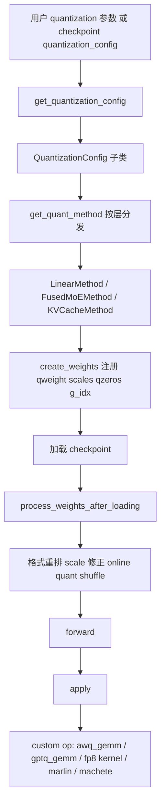

# vLLM 量化学习：从数学原理、校准补偿到 GPU 内核与推理路径

本文基于当前工作区中的 vLLM 源码进行系统梳理，目标不是重复官网用法，而是把下面四件事讲透：

1. vLLM 里每个量化注册名背后的数学对象到底是什么。
2. 校准、误差补偿、动态或静态 scale 是如何定义与求解的。
3. GPU 内核如何把反量化、GEMM、Norm、激活函数和量化融合起来。
4. 这些量化权重怎样嵌入 vLLM 的模型加载、权重处理和最终推理执行路径。

本文覆盖的源码主目录有两类：

- Python 配置与调度层：`vllm/model_executor/layers/quantization/`
- CUDA/CUTLASS/Triton 内核层：`csrc/quantization/`

先给出一个总判断：vLLM 注册的量化方法很多，但“数学家族”并没有那么多。很多注册名只是同一种数学量化思想在不同后端、不同 checkpoint 格式、不同 MoE 路径下的工程化封装。

---

## 1. 量化全景图：注册项、数学家族与工程别名

### 1.1 注册项并不等于全新算法

当前源码里可见的主要注册项包括：

- `awq`
- `awq_marlin`
- `cpu_awq`
- `gptq`
- `gptq_marlin`
- `compressed-tensors`
- `gguf`
- `bitsandbytes`
- `fp8`
- `fbgemm_fp8`
- `fp_quant`
- `modelopt`
- `modelopt_fp4`
- `modelopt_mxfp8`
- `modelopt_mixed`
- `quark`
- `torchao`
- `inc`
- `mxfp4`
- `gpt_oss_mxfp4`
- `mxfp8`
- `online`
- `fp8_per_tensor`
- `fp8_per_block`
- `int8_per_channel_weight_only`
- `experts_int8`
- `moe_wna16`

这些名字可以压缩成几个真正的“数学家族”：

| 数学家族 | 代表注册项 | 本质 |
| --- | --- | --- |
| AWQ | `awq`, `awq_marlin`, `cpu_awq` | 以激活敏感性为指导的 4-bit weight-only 量化 |
| GPTQ | `gptq`, `gptq_marlin`, `inc`, `compressed-tensors` | 基于二阶近似和误差补偿的 weight-only 量化 |
| GGUF/GGML | `gguf` | GGML 生态的多种 block-quant 编码 |
| BnB | `bitsandbytes` | LLM.int8、FP4、NF4、double quant |
| FP8 | `fp8`, `fbgemm_fp8`, `fp_quant`, `online`, `fp8_per_tensor`, `fp8_per_block` | 权重或激活量化到 FP8，支持静态和动态 scale |
| MX 系列 | `mxfp8`, `mxfp4`, `gpt_oss_mxfp4`, `modelopt_mxfp8`, `modelopt_fp4`, `quark` 的部分 scheme | block microscaling，局部共享 scale 的 FP8/FP4 |
| INT8 专家量化 | `experts_int8`, `int8_per_channel_weight_only` | MoE 专家权重在线 INT8 |
| 厂商导出封装 | `modelopt`, `modelopt_mixed`, `quark`, `torchao` | 把外部工具导出的量化 checkpoint 映射进 vLLM 运行时 |
| MoE 后备路径 | `moe_wna16` | MoE 的 WnA16 路径，更多是工程兼容层 |

因此，阅读源码时一定要区分两层概念：

- 数学量化方案：例如 AWQ、GPTQ、NF4、FP8、MXFP4。
- vLLM 工程接入方式：例如 Marlin 后端、Machete 后端、OnlineQuant alias、ModelOpt wrapper。

### 1.2 vLLM 的注册与分发机制

下面这段代码定义了可被用户指定的量化字符串，并把字符串映射到对应的配置类。

```python
QuantizationMethods = Literal[
    "awq",
    "fp8",
    "fbgemm_fp8",
    "fp_quant",
    "modelopt",
    "modelopt_fp4",
    "modelopt_mxfp8",
    "modelopt_mixed",
    "gguf",
    "gptq_marlin",
    "awq_marlin",
    "gptq",
    "compressed-tensors",
    "bitsandbytes",
    "experts_int8",
    "quark",
    "moe_wna16",
    "torchao",
    "inc",
    "mxfp4",
    "gpt_oss_mxfp4",
    "mxfp8",
    "cpu_awq",
    "online",
    "fp8_per_tensor",
    "fp8_per_block",
    "int8_per_channel_weight_only",
]
```

它背后的调度逻辑是：

1. 用户指定一个 `quantization` 字符串，或者 checkpoint 的 `quantization_config` 自带量化信息。
2. `get_quantization_config()` 返回对应的 `QuantizationConfig` 子类。
3. 每个 `QuantizationConfig` 再根据 layer 类型，把线性层、Attention、FusedMoE 分发到不同的 `QuantizeMethodBase` 子类。
4. 真正执行时由对应 method 决定如何创建权重、如何加载后处理、如何调用 CUDA 内核。

这意味着：vLLM 的量化不是一个“单函数入口”，而是一个多态分发系统。

---

## 2. 量化基础：统一数学框架

### 2.1 标量均匀量化

最常见的均匀量化可写成：

$$
q(x; s, z) = \operatorname{clip}\left(\left\lfloor \frac{x}{s} \rceil + z, q_{\min}, q_{\max}\right)
$$

反量化为：

$$
\hat{x} = s \cdot (q - z)
$$

其中：

- $s > 0$ 是 scale。
- $z$ 是 zero-point。
- 对称量化通常取 $z = 0$ 或中点编码。
- 非对称量化允许用 $z$ 吸收分布偏移。

若是对称 INT8，常写成：

$$
q = \operatorname{clip}\left(\left\lfloor \frac{x}{s} \rceil, -127, 127\right),
\quad
\hat{x} = s q
$$

误差可以分解为舍入误差和截断误差：

$$
e(x) = x - \hat{x}
$$

当 $x/s$ 落在可表示区间内部时，误差主要来自舍入；超出可表示区间时，误差由饱和截断主导。

### 2.2 从 per-tensor 到 per-token/per-block

量化粒度决定了 scale 的共享范围。

#### per-tensor

整个张量共享一个 scale：

$$
s = \frac{\max |x|}{q_{\max}}
$$

优点是元数据最少，缺点是对分布异质性最不敏感。

#### per-channel

每个输出通道或者输入通道一个 scale。对线性层权重 $W \in \mathbb{R}^{m \times n}$，例如按输出通道量化：

$$
\hat{W}_{i,:} = s_i \cdot Q\left(\frac{W_{i,:}}{s_i}\right)
$$

#### per-group

把若干连续通道划成组，每组一个 scale：

$$
\hat{W}_{ij} = s_{g(i,j)} \cdot Q\left(\frac{W_{ij}}{s_{g(i,j)}}\right)
$$

group size 越小，误差越低，但 scale 和 zero-point 元数据越多。

#### per-token

每个 token 动态计算激活 scale：

$$
s_t = \frac{\max_j |a_{t,j}|}{q_{\max}}
$$

这会把激活量化从静态离线校准问题变成运行时动态缩放问题。

#### per-block 或 microscaling

把张量切成固定 block，例如 32 个元素共享一个局部 scale：

$$
\hat{x}_i = s_b \cdot f_q\left(\frac{x_i}{s_b}\right), \quad i \in B_b
$$

这里 $f_q$ 不一定是整数编码，也可以是 FP4、FP8 这样的低比特浮点编码。MXFP8 和 MXFP4 属于这一类。

### 2.3 校准、重构与误差补偿

如果 scale 不是运行时动态计算，而是离线固定，那么就要用校准集 $\mathcal{D}_{cal}$ 去估计最优量化参数：

$$
\Theta^* = \arg\min_{\Theta} \mathbb{E}_{x \sim \mathcal{D}_{cal}} L\big(f(x; W), f(x; \hat{W}(\Theta))\big)
$$

不同算法的区别主要体现在：

- 误差度量选什么：权重误差、输出误差、二阶近似误差。
- 哪些参数可调：scale、zero-point、codebook、列顺序、块大小。
- 是否做误差补偿：例如 GPTQ 的 Hessian 逆更新。
- 是否保留高精度路径：例如 LLM.int8 的 outlier bypass。

---

## 3. vLLM 的量化执行框架

### 3.1 核心接口：`create_weights`、`process_weights_after_loading`、`apply`

vLLM 的量化抽象非常清晰，所有量化方法最终都要实现三个阶段。

```python
class QuantizeMethodBase(ABC):
    uses_meta_device: bool = False

    @abstractmethod
    def create_weights(self, layer: torch.nn.Module, *weight_args, **extra_weight_attrs):
        raise NotImplementedError

    @abstractmethod
    def apply(self, layer: torch.nn.Module, *args, **kwargs) -> torch.Tensor:
        raise NotImplementedError

    def process_weights_after_loading(self, layer: nn.Module) -> None:
        return
```

三个阶段分别对应：

1. `create_weights()`
   为 layer 注册参数对象，参数形状不是原始 `weight`，而是 `qweight`、`scales`、`qzeros`、`g_idx` 之类的量化张量。
2. `process_weights_after_loading()`
   在 checkpoint 真正复制到参数后，再做格式重排、scale 修正、零点变换、online quantization、Marlin shuffle 等后处理。
3. `apply()`
   推理时真正把输入激活和量化权重送进自定义内核。

### 3.2 为什么这个接口设计很重要

它把“量化”拆成了三种本质不同的工作：

- 存储格式定义。
- 加载期变换。
- 运行期算子选择。

很多初学者会把量化理解为一次性把 `weight` 变小；但在 vLLM 里，真正困难的部分恰好是后两步：

- 加载期要把 checkpoint 中的编码格式变成内核友好的内存布局。
- 运行期要在不同 GPU 架构上选择 Marlin、CUTLASS、Machete、FlashInfer 或自定义 kernel。

---

## 4. AWQ：激活感知的 4-bit 权重量化

### 4.1 核心思想

AWQ 的关键观察不是“所有权重同等重要”，而是：对最终输出误差更敏感的，是那些会与大激活相乘的权重通道。于是它不直接最小化权重误差，而是尽量最小化输出误差。

设线性层输出为：

$$
y = W x
$$

引入对角缩放矩阵 $S = \operatorname{diag}(s_1, \dots, s_d)$，则有严格等价变换：

$$
Wx = (WS)(S^{-1}x)
$$

AWQ 的关键就是只量化缩放后的权重 $WS$，优化目标变成：

$$
\min_S \mathbb{E}_x \left\| Q(WS)S^{-1}x - Wx \right\|_2^2
$$

记第 $j$ 列权重为 $w_j$，定义列误差：

$$
e_j(s_j) = Q(s_j w_j) - s_j w_j
$$

则输出误差为：

$$
\Delta y = \sum_j \frac{x_j}{s_j} e_j(s_j)
$$

忽略列间交叉项后，可近似得到：

$$
\mathbb{E}\|\Delta y\|_2^2 \approx \sum_j \frac{\mathbb{E}[x_j^2]}{s_j^2} \|e_j(s_j)\|_2^2
$$

这个式子说明了 AWQ 的本质：

- 如果某个通道激活方差大，$\mathbb{E}[x_j^2]$ 大，那么误差会被放大。
- 通过调大 $s_j$，可以降低该通道误差被 $S^{-1}$ 放大的程度。

这也是“activation-aware”一词的严格数学来源。

### 4.2 校准与显著通道保护

AWQ 实际会用校准数据估计激活幅度，然后对重要通道施加更有利的缩放。常见实践会用一维或少量超参数搜索，把 scale 参数化为某种激活统计与权重统计的组合，例如：

$$
s_j \propto \frac{\|x_j\|^{\alpha}}{\|w_j\|^{1-\alpha}}
$$

这里 $\alpha$ 通过校准集搜索。不同工具链具体实现不同，但数学思想一致：

- 不是盲目把所有列都压成同等量化精度。
- 而是优先保护“会被大激活命中”的列。

### 4.3 vLLM 中的 AWQ 参数布局

AWQ 在 vLLM 中使用 packed 权重、group scales 和 packed zero-points。

```python
qweight = PackedvLLMParameter(
    data=torch.empty(
        input_size_per_partition,
        output_size_per_partition // self.quant_config.pack_factor,
        dtype=torch.int32,
    ),
    input_dim=0,
    output_dim=1,
    packed_dim=1,
    packed_factor=self.quant_config.pack_factor,
)

qzeros = PackedvLLMParameter(
    data=torch.empty(
        num_groups,
        output_size_per_partition // self.quant_config.pack_factor,
        dtype=torch.int32,
    ),
    packed_dim=1,
    packed_factor=self.quant_config.pack_factor,
)

scales = GroupQuantScaleParameter(
    data=torch.empty(num_groups, output_size_per_partition, dtype=params_dtype),
    input_dim=0,
    output_dim=1,
)
```

这里的工程含义是：

- `qweight` 把多个 4-bit 值打包进 `int32`。
- `qzeros` 也是按组打包。
- `scales` 则是每个 group 对每个输出通道的 scale。

如果 `weight_bits = 4`，则：

$$
\text{pack\_factor} = \frac{32}{4} = 8
$$

即一个 32-bit 整数打包 8 个 4-bit 权重。

### 4.4 推理路径：小 batch 走 fused GEMM，大 batch 先反量化

```python
def apply(self, layer, x, bias=None):
    qweight = layer.qweight
    scales = layer.scales
    qzeros = layer.qzeros
    pack_factor = self.quant_config.pack_factor
    out_shape = x.shape[:-1] + (qweight.shape[-1] * pack_factor,)
    reshaped_x = x.reshape(-1, x.shape[-1])

    FP16_MATMUL_HEURISTIC_CONDITION = x.shape[:-1].numel() >= 256
    if FP16_MATMUL_HEURISTIC_CONDITION or envs.VLLM_BATCH_INVARIANT:
        out = ops.awq_dequantize(qweight, scales, qzeros, 0, 0, 0)
        out = torch.matmul(reshaped_x, out)
    else:
        out = ops.awq_gemm(reshaped_x, qweight, scales, qzeros, pack_factor)
    if bias is not None:
        out.add_(bias)
    return out.reshape(out_shape)
```

这段代码非常值得注意。它说明 vLLM 并不是永远走同一个 AWQ kernel，而是按 token 数启发式切换：

- token 较少时，直接走 `awq_gemm`，把反量化融合进 GEMM。
- token 较多时，先整体反量化，再交给常规矩阵乘。

这背后是吞吐与 launch 开销之间的折中。

### 4.5 AWQ CUDA 内核：LOP3 抽 nibble，半精度向量反量化

AWQ 的低层优化核心之一，是用位运算把 packed int4 快速展开成半精度向量。

```cpp
static constexpr uint32_t BOTTOM_MASK = 0x000f000f;
static constexpr uint32_t TOP_MASK = 0x00f000f0;
static constexpr uint32_t I4s_TO_F16s_MAGIC_NUM = 0x64006400;

asm volatile("lop3.b32 %0, %1, %2, %3, %4;\n"
             : "=r"(h[0])
             : "r"(i4s), "n"(BOTTOM_MASK), "n"(I4s_TO_F16s_MAGIC_NUM), "n"(immLut));

asm volatile("sub.f16x2 %0, %1, %2;\n"
             : "=r"(h[0])
             : "r"(i4s), "r"(FP16_TOP_MAGIC_NUM));
```

这里发生的事情是：

- 一个 `uint32` 里有 8 个 4-bit 值。
- `lop3.b32` 用逻辑查找表把 nibble 抽出来并拼成“看起来像 FP16”的中间格式。
- `0x64006400` 这种 magic number 其实对应半精度常数编码，用来把整数位图快速映射成半精度数值域。
- 最后再减去 zero-point、乘以 scale，得到真正的半精度权重。

这类写法比逐元素移位和类型转换快得多，因为它把多个元素的解包合并成极少数 PTX 指令。

### 4.6 AWQ GEMM：反量化与矩阵乘法融合

AWQ 的 GEMM 内核不是“先全量反量化到全局内存，再 GEMM”，而是在 shared memory 级别完成：

```cpp
uint32_t B_loaded = *(uint32_t*)(B_ptr_local + ax0_ax1_fused_0 * row_stride * (OC / 8));
uint4 B_loaded_fp16 = dequantize_s4_to_fp16x2(B_loaded);

asm volatile("sub.f16x2 %0, %1, %2;\n"
             : "=r"(B_loaded_fp16.x)
             : "r"(B_loaded_fp16.x), "r"(B_loaded_zero.x));
asm volatile("fma.rn.f16x2 %0, %1, %2, %3;\n"
             : "=r"(B_loaded_fp16.x)
             : "r"(B_loaded_fp16.x), "r"(B_loaded_scale.x), "r"(ZERO));
```

这对应的数学过程正是：

$$
\hat{w} = s_g (q - z_g)
$$

但工程上它被改写成一串向量化的 `sub.f16x2` 和 `fma.rn.f16x2`，以减少寄存器和指令开销。

### 4.6.1 内核启动配置详解：`gemm_forward_4bit_cuda_m16nXk32<128>`

上面的代码片段只是内核内部，真正的入口是 `awq_gemm.cu` 里的 CPU 端调度逻辑：

```cpp
// 当 OC % 128 == 0 时，选用 N=128 的 tile 宽度
int j_factors1 = num_out_channels / 128 / 1;          // output-channel 方向的 tile 数
dim3 num_blocks(
    (num_out_feats + 16 - 1) / 16   // M 方向 tile 数（每块处理 16 行）
    * j_factors1                     // N 方向 tile 数
    * split_k_iters                  // K 方向切片数
);
dim3 threads_per_block(32, 2);      // 32 lanes × 2 warps = 64 threads/block

vllm::awq::gemm_forward_4bit_cuda_m16nXk32<128>
    <<<num_blocks, threads_per_block, 0, stream>>>(
        group_size,      // 量化分组大小 G（例如 128）
        split_k_iters,   // K 轴切分份数
        in_feats,        // A：激活矩阵 [M, IC]，fp16
        kernel,          // B：量化权重 [IC, OC/8]，int32（每个 int32 packed 8 个 int4）
        scaling_factors, // 缩放因子 [IC/G, OC]，fp16
        zeros,           // 零点 [IC/G, OC/8]，int32
        num_in_feats,    // M（batch 行数，≤16）
        num_in_channels, // IC（输入通道数）
        num_out_channels,// OC（输出通道数）
        out_feats        // 输出：partial sums [split_k_iters, M, OC]，fp16
    );

// 最后把 split_k_iters 份 partial sum 在 dim0 上加和，得到 [M, OC]
return _out_feats.sum(0);
```

#### 模板参数 `N`：CTA tile 宽度

`N` 是每个 CUDA block 处理的 **输出通道列数**（output-channel tile width）。  
代码中只支持 `N=64` 或 `N=128`，具体分支由 `num_out_channels % 128 == 0` 决定：

| OC 能否整除 128 | 选用 N | shared memory B tile |
|---|---|---|
| 是 | 128 | `32 × (128+8)` fp16 |
| 否（但整除 64）| 64 | `32 × (64+8)` fp16 |

"m16n**X**k32" 的命名含义：每块 MMA tile 的形状为 M=16、N=X、K=32（一次循环处理 32 个 K 方向元素）。

#### Grid / Block 映射

```
gridDim.x  = ceil(M/16) × (OC/N) × split_k_iters
blockDim   = (32, 2)   →  2 个 warp，共 64 threads
```

- **`threadIdx.x`**（0–31）：warp 内的 lane ID，用于向量化 load/store 和 `ldmatrix` 寻址。
- **`threadIdx.y`**（0–1）：block 内的 warp ID，每个 warp 负责不同的 N/2 输出列半区。
- **`blockIdx_y`**（从 `blockIdx.x` 还原）：编码了"这块负责哪个 M-tile × N-tile"。
- **`blockIdx_z`**（从 `blockIdx.x` 还原）：编码了"这块负责哪个 K 切片"（split-K 维）。

```cpp
int blockIdx_y = blockIdx.x % ((M + 16 - 1) / 16 * j_factors1);
int blockIdx_z = blockIdx.x / ((M + 16 - 1) / 16 * j_factors1);
```

#### Split-K 策略

AWQ GEMM 专为 **小 batch（M ≤ 16）** 设计，此时 M 维度几乎不提供并行度。  
为了充分利用 GPU，内核把 K（IC）方向切成 `split_k_iters` 份，让多个 block 在不同 K 区间并行累加，输出形状为 `[split_k_iters, M, OC]`，最后在 CPU 侧 `sum(0)` 归约：

$$
\text{output}[m, n] = \sum_{k=0}^{K-1} \hat{W}[k, n] \cdot a[m, k]
= \sum_{s=0}^{S-1} \underbrace{\sum_{k \in \text{slice}_s} \hat{W}[k,n] \cdot a[m,k]}_{\text{block}_s \text{ partial sum}}
$$

其中 $S = \text{split\_k\_iters}$，每个 block 只迭代 $\lceil K/S \rceil$ 个 32 元素的 K 步长，最后 `_out_feats.sum(0)` 完成跨切片的规约。

#### 内核主循环结构

```
for _k_0_0 in range(k_bound):           // 每步处理 32 个 K 元素
    ① 从全局内存 load A tile → A_shared  // uint4 (16 个 fp16)
    ② load zeros/scales（来自量化参数）
    ③ for ax0_ax1_fused_0 in range(N/16):  // 遍历 N 方向 tile 的列分片
           load B (int32 packed) → dequantize_s4_to_fp16x2
           sub.f16x2 (减 zero)  →  fma.rn.f16x2 (乘 scale)
           write back → B_shared
    __syncthreads()
    for k_0_1 in {0, 1}:                // 一步 32 K 分成两次 16 K MMA
        ldmatrix A_shared → A_warp regs
        ldmatrix B_shared → B_warp regs（转置加载）
        mma.sync m16n8k16 (Ampere) / 4×m16n8k8 (Turing)
```

`mma.sync.aligned.m16n8k16` 是 Ampere tensor core 指令，每次调用处理 16×8×16 的子矩阵。  
SM75（Turing）没有 k16 版本，于是拆成 4 次 `m16n8k8` 来等效。

#### `k_bound` 的边界处理

```cpp
int k_bound = (IC / 32 + split_k_iters - 1) / split_k_iters;
// 防止最后一个 K-slice 越界
if ((k_bound - 1) * split_k_iters * 32 + blockIdx_z * 32 >= IC)
    k_bound -= 1;
```

这保证了不同 `blockIdx_z` 的 block 都只访问合法的 K 区间，不会越界读取激活或权重数据。

#### 整体调用路径小结

```
Python: ops.awq_gemm(x, qweight, scales, qzeros, pack_factor)
  ↓
C++/CUDA: awq_gemm() 计算 grid/block → 选 N=128 or N=64
  ↓
kernel: gemm_forward_4bit_cuda_m16nXk32<N>
  ├── dequantize_s4_to_fp16x2  (LOP3 nibble 展开)
  ├── sub.f16x2                 (减零点)
  ├── fma.rn.f16x2              (乘缩放因子)
  ├── ldmatrix                  (从 shared → 寄存器)
  └── mma.sync m16n8k16         (tensor core 累加)
  ↓
返回 partial sums [split_k_iters, M, OC]
  ↓
_out_feats.sum(0) → 最终结果 [M, OC]
```

### 4.6.2 内核内部实现逐段解析

#### 寄存器与共享内存声明

```cpp
static constexpr uint32_t ZERO = 0x0;   // fp16x2 的 +0.0 编码
float C_warp[32];                        // 每个 warp 的累加寄存器，共 N/32 * 8 个 float
__shared__ half A_shared[16 * (32 + 8)]; // A tile：16 行 × 40 列（+8 padding 避免 bank 冲突）
__shared__ half B_shared[32 * (N + 8)];  // B tile：32 行 × (N+8) 列，padding 同上

half A_shared_warp[8];    // 从 shared 加载到寄存器的 A fragment（ldmatrix x4 = 8 half）
half B_shared_warp[N/4];  // 从 shared 加载到寄存器的 B fragment（N=128 时 = 32 half）
```

**padding 原因**：`half A_shared[16 * (32+8)]` 中的 `+8` 是 8 个 `half`（= 16 字节 = 1 个 bank 宽度），用于错开不同线程对 shared memory bank 的访问，消除 bank conflict。

初始化：

```cpp
for (int j_0_4_init = 0; j_0_4_init < N / 32; ++j_0_4_init)
    for (int i = 0; i < 8; ++i)
        C_warp[(j_0_4_init * 8) + i] = 0.0;
```

`C_warp` 共 `N/32 * 8` 个 float。对 N=128，`N/32 = 4`，所以 32 个 float，覆盖此 warp 负责的全部 m16n8 输出片段。

---

#### 指针计算：每个线程负责哪些数据

代码里所有指针都在 kernel 开头一次性算好，后续迭代只做偏移。

**A 指针**（激活矩阵，全局内存 → A_shared）：

```cpp
// row_stride_warp = 32*8/32 = 8  （每个 warp 一次 load 覆盖的行数）
static constexpr int row_stride_warp = 32 * 8 / 32;

half* A_ptr =
    A +
    (blockIdx_y / j_factors1 * 16          // 本块负责的 M tile 起始行
     + threadIdx.y * row_stride_warp        // warp 内行偏移
     + threadIdx.x / (32 / 8)) * IC        // lane 内行偏移（每 4 lane 一行）
    + threadIdx.x % (32 / 8) * 8;          // lane 内列偏移（8 个 half = uint4）
```

每次 load 用 `*(uint4*)(A_ptr + k_0_0 * 32)` 读 16 字节（8 个 half），即 8 个 K 方向元素。2 个 warp × 8 行/warp × 2 次 uint4 = 整个 16×32 的 A tile 被 64 threads 协作搬入 A_shared。

`ld_A_flag` 做越界保护：若 batch 行数 M 不足 16，padding 行写 0。

**B 指针**（量化权重，全局内存 → B_shared）：

```cpp
// row_stride = 2*32*8/N （N=128 时 = 4）
static constexpr int row_stride = 2 * 32 * 8 / N;

int* B_ptr = B
    + threadIdx.y * (OC / 8) * (256 / N)       // warp 行偏移（K 方向）
    + (threadIdx.x / (N / 8)) * (OC / 8)        // lane 行偏移
    + (blockIdx_y % j_factors1) * (N / 8)        // 本块负责的 N tile 起始列（以 int32 计）
    + threadIdx.x % (N / 8);                     // lane 列偏移
```

每次 load 读 1 个 `uint32`（packed 8 个 int4），经 `dequantize_s4_to_fp16x2` 展开成 `uint4`（8 个 half），写入 B_shared。

**C 指针**（输出，B_shared 计算结果回写全局内存）：

```cpp
half* C_ptr =
    C + (long long)blockIdx_z * M * OC   // split_k 切片偏移
    + (blockIdx_y % j_factors1) * N       // N tile 列起始
    + threadIdx.y * (N / 2)               // warp 负责 N/2 列
    + (threadIdx.x % 4) * 2;             // lane 内 2 列
```

输出写回时还需要加上行偏移 `row_offset * OC`，因此此处只算好列基址。

---

#### 主 K 循环：搬数据 → 反量化 → 存入 shared

```cpp
for (int _k_0_0 = 0; _k_0_0 < k_bound; ++_k_0_0) {
    int k_0_0 = _k_0_0 * split_k_iters + blockIdx_z;  // 实际 K step index
    __syncthreads();  // 等上一轮 MMA 结束，shared 可复用
```

**① load A tile**

```cpp
if (ld_A_flag)
    *(uint4*)(A_shared_ptr) = *(uint4*)(A_ptr + k_0_0 * 32);
else
    *(uint4*)(A_shared_ptr) = make_uint4(0, 0, 0, 0);
```

`k_0_0 * 32`：每步处理 32 个 K 元素，所以 K 方向步长为 32 个 `half`（= 64 bytes）。每个线程用一次 128-bit load（`uint4`）搬 8 个 half。

**② load zeros 和 scales**

```cpp
uint32_t zeros_loaded = *(uint32_t*)(zeros_ptr + k_0_0 * 32 / G * (OC / 8));
uint4 B_loaded_zero  = dequantize_s4_to_fp16x2(zeros_loaded);  // 1 int32 → 8 fp16
uint4 B_loaded_scale = *(uint4*)(scaling_factors_ptr + k_0_0 * 32 / G * (OC));
```

- `k_0_0 * 32 / G`：每 G 个 K 元素共享一组 scale/zero，所以除以 G 得到分组索引。
- `zeros_loaded` 也是 packed int4（8 个零点），同样经过 `dequantize_s4_to_fp16x2` 展开成 8 个 half，存在 `uint4` 的四个 32-bit 字段（`.x/.y/.z/.w`），每个字段包含 2 个 half（= `half2`）。
- `B_loaded_scale` 是 8 个 fp16 scale，直接 128-bit load。

**③ B tile 反量化循环**

```cpp
int* B_ptr_local = B_ptr + k_0_0 * 32 * (OC / 8);  // 当前 K step 的 B 起始

for (int ax0_ax1_fused_0 = 0; ax0_ax1_fused_0 < N / 16; ++ax0_ax1_fused_0) {
    // 每次 load 1 个 int32 → 展开 8 fp16
    uint32_t B_loaded = *(uint32_t*)(B_ptr_local + ax0_ax1_fused_0 * row_stride * (OC / 8));
    uint4 B_loaded_fp16 = dequantize_s4_to_fp16x2(B_loaded);
```

循环 `N/16` 次（N=128 时 8 次），每次处理 B 中 16 列方向的一小段。

反量化的 3 步：

```cpp
// 步骤 1：减 zero-point（向量化，一次处理 2 个 half）
asm volatile("sub.f16x2 %0, %1, %2;\n"
             : "=r"(B_loaded_fp16.x)
             : "r"(B_loaded_fp16.x), "r"(B_loaded_zero.x));
// 步骤 2：乘 scale（fma a*b+0，等价于乘法）
asm volatile("fma.rn.f16x2 %0, %1, %2, %3;\n"
             : "=r"(B_loaded_fp16.x)
             : "r"(B_loaded_fp16.x), "r"(B_loaded_scale.x), "r"(ZERO));
// ... y/z/w 同理，共 4 对 sub + fma = 8 个 half 完成反量化
```

数学上是 $\hat{w}_i = s_i \cdot (q_i - z_i)$，工程上分两条 PTX 指令：

$$
\underbrace{q_i - z_i}_{\texttt{sub.f16x2}} \xrightarrow{\times s_i} \underbrace{(q_i-z_i) \cdot s_i + 0}_{\texttt{fma.rn.f16x2}}
$$

注释里也说明：理论上可以改写成 $q_i \cdot s_i - z_i \cdot s_i$ 节省 4 条 sub 指令，但当前代码未做这个优化。

反量化完成后写回 B_shared：

```cpp
*(uint4*)(B_shared_ptr + ax0_ax1_fused_0 * row_stride * (N + 8)) = B_loaded_fp16;
```

`__syncthreads()`：等待所有 thread 写完 A_shared 和 B_shared，再进入 MMA 计算。

---

#### 内层 MMA 循环：ldmatrix + tensor core

外层 `for k_0_1 in {0, 1}` 把 32 个 K 元素拆成两段 16 执行，每次做一个 m16n8k16 tile：

---

**① 地址转换：cvta.to.shared + cvt.u32.u64**

```cpp
unsigned int addr;
__asm__ __volatile__(
    "{ .reg .u64 addr; cvta.to.shared.u64 addr, %1; cvt.u32.u64 %0, addr; }\n"
    : "=r"(addr)
    : "l"((void*)(&A_shared[k_0_1 * 16]
                  + (threadIdx.x & 15) * 40       // 行号 × 行步长（40 half）
                  + (threadIdx.x >> 4) * 8)));     // 高 bit 决定列偏移 0 or 8
```

PTX 中有两个独立的地址空间：
- **generic（通用）空间**：C++ 指针默认所在，64-bit，涵盖 global/shared/local。
- **shared 空间**：仅限 shared memory，32-bit 偏移（相对于 shared 基址）。

`ldmatrix` 要求地址必须是 **shared 空间的 32-bit 偏移**，因此需要两步转换：

| 指令 | 作用 |
|------|------|
| `cvta.to.shared.u64 dst, src` | 把 generic 64-bit 指针 `src` 转成 shared 地址空间的 64-bit 偏移 |
| `cvt.u32.u64 dst, src` | 截断成 32-bit（shared 地址空间够用 32 bit） |

**寻址逻辑**：A_shared 的逻辑布局是 16 行 × 40 列（32 数据 + 8 padding）。每个 lane `t` 的地址指向：

```
行  = t & 15       （低 4 位，0–15 中的哪一行）
列  = k_0_1 * 16   （当前 k_0_1 段的列起始，0 或 16）
    + (t >> 4) * 8 （高 bit = 0 → 列偏移 0；高 bit = 1 → 列偏移 +8）
```

即：
- 0–15 号 lane → 指向 A_shared 的第 0–15 行、列起始 `k_0_1*16`
- 16–31 号 lane → 指向 A_shared 的第 0–15 行、列起始 `k_0_1*16 + 8`

32 个 lane 合起来恰好覆盖了 16 行 × 16 列的完整 A tile。

---

**② ldmatrix 加载 A fragment**

```cpp
__asm__ __volatile__(
    "ldmatrix.sync.aligned.m8n8.x4.shared.b16"
    "{%0, %1, %2, %3}, [%4];\n"
    : "=r"(A_warp[0]), "=r"(A_warp[1]), "=r"(A_warp[2]), "=r"(A_warp[3])
    : "r"(addr));
```

**指令名拆解**：

| 字段 | 含义 |
|------|------|
| `ldmatrix` | 协作式矩阵加载指令（Ampere/Turing+） |
| `.sync` | warp 内所有 lane 同步执行（无提前退出） |
| `.aligned` | 要求源地址 128-bit 对齐 |
| `.m8n8` | 每个子矩阵的形状：8 行 × 8 列（元素为 b16） |
| `.x4` | 一次加载 4 个这样的子矩阵 |
| `.shared` | 源地址必须在 shared 地址空间 |
| `.b16` | 元素宽度 = 16 bit（fp16/bf16 均可） |

**执行语义**：

- 每个 lane 各自提供一个地址，指向 shared memory 中某行的起始（一行 = 8 个 b16 = 128 bit = 1 uint4）。
- 32 个 lane 合作覆盖 4 个 m8n8 矩阵，共 $4 \times 8 = 32$ 行，每行 8 列，恰好 32 条指针——每 lane 一条。
- 执行后，每个 lane 的寄存器 `{A_warp[0], A_warp[1], A_warp[2], A_warp[3]}` 中存放了从 4 个矩阵里**各取一片**的数据，总共 4 × 32-bit = 128 bit = 8 个 fp16。
- 这 8 个 fp16 正好对应后续 `mma.sync.m16n8k16` 中 **A fragment** 要求的格式：32 lane × 8 fp16 = 256 fp16 = $16 \times 16$ 矩阵。

**为什么一次 ldmatrix 能完成整个 tile 的 load**：

```
ldmatrix.x4 加载总量 = 4 个 m8n8 × (8行×8列×2字节) = 4 × 128 = 512 字节
                     = 16行 × 16列 × 2字节（16×16 fp16 矩阵）
```

32 个 lane 同时发出各自的地址，硬件在一个指令周期内完成所有 shared memory 读取和寄存器分发，效率远高于每个 lane 独立 load 后再做 shuffle。

---

**③ ldmatrix.trans 加载 B fragment（转置）**

```cpp
__asm__ __volatile__(
    "ldmatrix.sync.aligned.m8n8.x4.trans.shared.b16"
    "{%0, %1, %2, %3}, [%4];\n"
    : "=r"(B_warp[ax1_0 * 8 + 0]), "=r"(B_warp[ax1_0 * 8 + 1]),
      "=r"(B_warp[ax1_0 * 8 + 2]), "=r"(B_warp[ax1_0 * 8 + 3])
    : "r"(addr));
```

相比加载 A 多了一个 **`.trans`** 修饰符：

**为什么需要转置？**

B_shared 是按**行优先（row-major）**存储的：每行是 K 方向（16 个元素），列方向是 N。  
但 `mma.sync` 对 B 的寄存器布局要求是**列优先（col-major）**：即每个 lane 持有的是 B 的某几列的连续元素，而非某几行。

如果不转置，加载进来的数据按行排列，传给 `mma.sync` 会产生错误的乘法结果。`.trans` 指令让硬件在读取 shared memory 的同时完成 $8 \times 8$ 子矩阵的转置，**零成本**地把 row-major 数据转成 col-major 寄存器布局，无需额外的 `__shfl_sync` 或寄存器搬运。

**`ax1_0` 循环的含义**：

```cpp
for (int ax1_0 = 0; ax1_0 < N / 32; ++ax1_0) {  // N=128 → 0,1,2,3
```

每次 `ax1_0` 处理 B 中 **32 列**的子块（2 个 m8n8 = 16 列 × 2），配合后面 `j_0_4` 循环里每次发射 2 个 `mma.sync` 覆盖这 32 列。  
`B_warp[ax1_0*8 .. ax1_0*8+3]` 分别存 4 个子矩阵的 B fragment。

---

**④ MMA 指令：mma.sync.aligned.m16n8k16.row.col.f32.f16.f16.f32**

**Ampere (SM80+)**：

```cpp
__asm__ __volatile__(
    "mma.sync.aligned.m16n8k16.row.col.f32.f16.f16.f32"
    "{%0, %1, %2, %3},"           // D（输出 C fragment，4 个 f32）
    "{%4, %5, %6, %7},"           // A fragment（4 个 u32 = 8 个 fp16）
    "{%8, %9},"                   // B fragment（2 个 u32 = 4 个 fp16）
    "{%10, %11, %12, %13};\n"     // C（输入 accumulator，4 个 f32）
    : "=f"(C_warp[j*8+0]), "=f"(C_warp[j*8+1]),
      "=f"(C_warp[j*8+2]), "=f"(C_warp[j*8+3])
    : "r"(A_warp[0]), "r"(A_warp[1]), "r"(A_warp[2]), "r"(A_warp[3]),
      "r"(B_warp[j*8+0]), "r"(B_warp[j*8+1]),
      "f"(C_warp[j*8+0]), "f"(C_warp[j*8+1]),
      "f"(C_warp[j*8+2]), "f"(C_warp[j*8+3]));
```

**指令名拆解**：

| 字段 | 含义 |
|------|------|
| `mma.sync` | warp 内同步矩阵乘加（Matrix Multiply-Accumulate） |
| `.aligned` | fragment 寄存器必须对齐分配 |
| `m16n8k16` | 计算 shape：$M=16$ 行、$N=8$ 列、$K=16$ 内积维 |
| `.row` | A 矩阵按行优先排布（row-major）|
| `.col` | B 矩阵按列优先排布（col-major）|
| `f32` | 输出 D（即新的 C）类型：float32 |
| `f16` | A 操作数类型：fp16 |
| `f16` | B 操作数类型：fp16 |
| `f32` | 输入 accumulator C 类型：float32 |

**计算语义**：

$$
D_{[16 \times 8]} = A_{[16 \times 16]} \times B_{[16 \times 8]} + C_{[16 \times 8]}
$$

32 个 lane 协作，每个 lane 负责输出 $16 \times 8$ 矩阵中的 **4 个元素**（2 行 × 2 列），具体 lane-to-element 映射（PTX 标准布局）：

```
lane t 持有的 4 个 D 元素：
  D[ row_hi(t)*8 + row_lo(t),  col(t)   ]   → %0
  D[ row_hi(t)*8 + row_lo(t),  col(t)+1 ]   → %1
  D[ row_hi(t)*8 + row_lo(t)+8, col(t)  ]   → %2   ← 跨 8 行
  D[ row_hi(t)*8 + row_lo(t)+8, col(t)+1]   → %3

其中：
  row_hi(t) = t / 4 % 2    （t 的 bit[2]，决定上半 8 行或下半 8 行）
  row_lo(t) = t % 4 / 2    （t 的 bit[1]，决定组内行）
  col(t)    = (t / 4 / 2) * 2  + t % 2    （列偏移）
```

直白地说：

```
lane 0  → D[0,0], D[0,1], D[8,0], D[8,1]
lane 1  → D[0,2], D[0,3], D[8,2], D[8,3]
lane 2  → D[0,4], D[0,5], D[8,4], D[8,5]
lane 3  → D[0,6], D[0,7], D[8,6], D[8,7]
lane 4  → D[1,0], D[1,1], D[9,0], D[9,1]
...
lane 28 → D[7,0], D[7,1], D[15,0], D[15,1]
lane 29 → D[7,2], D[7,3], D[15,2], D[15,3]
lane 30 → D[7,4], D[7,5], D[15,4], D[15,5]
lane 31 → D[7,6], D[7,7], D[15,6], D[15,7]
```

**为什么 A 需要 4 个 u32，B 只需要 2 个**：

- A：$16 \times 16 \times \text{fp16} = 512$ bytes，分给 32 lane，每 lane $= 16$ bytes $= 8$ fp16 $= 4$ u32。
- B：$16 \times 8 \times \text{fp16} = 256$ bytes，分给 32 lane，每 lane $= 8$ bytes $= 4$ fp16 $= 2$ u32。

**j_0_4 循环与两次 mma.sync**：

对 N=128，`j_0_4` 循环 4 次（`N/32 = 4`），每次 `j` 发射 **2 个** `mma.sync`：

```cpp
for (int j_0_4 = 0; j_0_4 < N / 32; ++j_0_4) {
    // 第 1 个 mma：处理 N tile 的低 8 列（C_warp[j*8 + 0..3]）
    mma(C_warp[j*8], A_warp, B_warp[j*8 + 0..1], C_warp[j*8]);
    // 第 2 个 mma：处理 N tile 的高 8 列（C_warp[j*8 + 4..7]）
    mma(C_warp[j*8+4], A_warp, B_warp[j*8 + 4..5], C_warp[j*8+4]);
}
```

4 次循环 × 2 次 mma = **8 次 mma.sync**，覆盖完整的 $16 \times 128$ 输出 tile（每次 m16n8，共 16 个 m16n8 子块）。

---

**⑤ Turing (SM75) 兼容路径**

```cpp
#if defined(__CUDA_ARCH__) && __CUDA_ARCH__ == 750
// SM75 最大支持 m16n8k8，需要 4 次来模拟一次 m16n8k16
// k[0:8]，B 的前 8 行 → 对应 C 的同一输出子块（累加）
asm("mma.sync.aligned.m16n8k8.row.col.f32.f16.f16.f32 {D0..3},{A0,A1},{B0},{C0..3}");
// k[0:8]，B 的前 8 行 → 对应 N tile 另一半（C_warp[j*8+4..7]）
asm("mma.sync.aligned.m16n8k8.row.col.f32.f16.f16.f32 {D4..7},{A0,A1},{B4},{C4..7}");
// k[8:16]，B 的后 8 行 → 同一 C 输出子块继续累加
asm("mma.sync.aligned.m16n8k8.row.col.f32.f16.f16.f32 {D0..3},{A2,A3},{B1},{C0..3}");
// k[8:16]，B 的后 8 行 → N tile 另一半
asm("mma.sync.aligned.m16n8k8.row.col.f32.f16.f16.f32 {D4..7},{A2,A3},{B5},{C4..7}");
#endif
```

`m16n8k8` 与 `m16n8k16` 的关键区别：

| | m16n8k16 (Ampere) | m16n8k8 (Turing) |
|---|---|---|
| A fragment | 4 u32（8 fp16，K=16） | 2 u32（4 fp16，K=8） |
| B fragment | 2 u32（4 fp16，K=16） | 1 u32（2 fp16，K=8） |
| 每 lane C 输出 | 4 f32 | 4 f32（相同） |
| 覆盖 K=16 需几次 | 1 次 | 2 次（k[0:8] + k[8:16]）|

Turing 的 4 次调用逻辑：把 $K=16$ 切成 $k_a=[0,8)$ 和 $k_b=[8,16)$ 两段，每段对 N tile 的两个 8-列子块各发一次 mma，共 $2 \times 2 = 4$ 次。每次的 A 寄存器分别是 `A_warp[0,1]`（$k_a$ 段）和 `A_warp[2,3]`（$k_b$ 段），B 寄存器也对应切半。

---

#### 结果回写（C_warp → 全局内存 C）

```cpp
for (int ax1_0_1 = 0; ax1_0_1 < N / 32; ++ax1_0_1) {
    for (int local_id = 0; local_id < 8; ++local_id) {
        // MMA 输出布局：每个 lane 持有 C 的 2×4 子块
        int row_offset = (blockIdx_y / j_factors1) * 16  // M tile 起始行
                       + threadIdx.x / 4                  // warp 内行组
                       + (local_id % 4) / 2 * 8;          // 行组内偏移（0 或 8）
        if (row_offset < M) {
            *(C_ptr + ax1_0_1 * 16                // N 方向偏移（每 ax1 块 16 列）
                    + row_offset * OC              // 行跨度
                    + (local_id / 4) * 8           // 列内偏移（0 或 8）
                    + local_id % 2)                // 最细列偏移（0 或 1）
              = __float2half(C_warp[(ax1_0_1 * 8) + local_id]);
        }
    }
}
```

MMA 的输出寄存器布局（PTX 标准）：每个 warp 的 32 个 lane 共同持有 $16 \times 8$ 的 C 子矩阵，每个 lane 拥有其中 4 个 float，排列如下：

```
lane 0 → C[0,0], C[0,1], C[8,0], C[8,1]
lane 1 → C[0,2], C[0,3], C[8,2], C[8,3]
...
lane 4 → C[1,0], C[1,1], C[9,0], C[9,1]
```

因此回写时 `row_offset` 通过 `threadIdx.x / 4` 和 `(local_id%4)/2*8` 联合还原实际行号，`(local_id/4)*8 + local_id%2` 还原列号。

---

#### 内核完整数据流一览

```
全局内存                         shared memory              寄存器
──────────────────────────────────────────────────────────────────
A[M,IC]  (fp16)
  │ 128-bit load (uint4)
  ▼
A_shared[16×40] (fp16)
  │ ldmatrix.x4
  ▼
A_shared_warp[8] (half regs) ─────────────────────────┐
                                                        │ mma.sync
B[IC,OC/8] (int32 packed)                              │ m16n8k16
  │ 32-bit load → dequantize_s4_to_fp16x2              │
  │ sub.f16x2 (减 zero)                                 │
  │ fma.rn.f16x2 (乘 scale)                            │
  ▼                                                     │
B_shared[32×(N+8)] (fp16)                              │
  │ ldmatrix.x4.trans                                   │
  ▼                                                     │
B_shared_warp[N/4] (half regs) ───────────────────────┘
                                                        ▼
                                               C_warp[32] (float regs)
                                                        │ __float2half
                                                        │ + 越界检查
                                                        ▼
                                               C[split_k×M×OC] (fp16)
```

### 4.7 AWQ 的几个工程变体

#### `awq_marlin`

数学上仍是 AWQ，只是把执行后端换成 Marlin，利用 tensor core 更高效地做 INT4 权重路径。

#### `cpu_awq`

数学上仍是 AWQ，但运行在 CPU 路径上，适用于没有 CUDA kernel 的环境。

#### MoE 场景的 `moe_wna16` 回退

源码里可以看到，若某个 FusedMoE layer 不满足 AWQ Marlin 的约束，vLLM 会回退到 `MoeWNA16Config`。这不是另一个数学算法，而是为了兼容 MoE 张量布局和后端约束的执行后备路径。

---

## 5. GPTQ：二阶近似驱动的误差补偿量化

### 5.1 从输出重构误差出发

GPTQ 的出发点比 AWQ 更直接：希望量化后线性层输出尽量接近原始输出。

对某一行权重向量 $w$ 和校准激活矩阵 $X$，目标是：

$$
\min_{\hat{w} \in \mathcal{Q}^d} \|wX - \hat{w}X\|_2^2
$$

把它展开：

$$
\|wX - \hat{w}X\|_2^2 = (w - \hat{w})XX^T(w - \hat{w})^T
$$

定义 Hessian 近似：

$$
H = XX^T
$$

于是问题变成：

$$
\min_{\hat{w} \in \mathcal{Q}^d} (w - \hat{w})^T H (w - \hat{w})
$$

这就是 GPTQ 的数学核心。它不是简单看权重本身，而是看权重误差在激活协方差度量下造成的输出误差。

### 5.2 贪心逐列量化与误差补偿

假设当前要量化第 $q$ 个坐标，未量化集合记为 $F$。在 GPTQ 的二阶近似下，最优贪心步的损失增量可写为：

$$
\Delta \mathcal{L}_q = \frac{1}{2} \frac{(w_q - \hat{w}_q)^2}{(H_F^{-1})_{qq}}
$$

当第 $q$ 列被量化为 $\hat{w}_q$ 后，其误差并不会简单地“留在原地”，而是传播给其余未量化权重：

$$
w_F \leftarrow w_F - \frac{w_q - \hat{w}_q}{(H_F^{-1})_{qq}} (H_F^{-1})_{Fq}
$$

这个更新式是 GPTQ 最关键的部分。它说明 GPTQ 的本质不是“量化一个值”，而是“量化一个值以后，立即把误差按 Hessian 逆的耦合结构补偿到剩余权重”。

### 5.3 dampening 与数值稳定性

实际中 $H = XX^T$ 可能病态，于是常加入阻尼：

$$
H \leftarrow H + \lambda I
$$

其中常见设置为：

$$
\lambda = \text{dampening\_frac} \cdot \frac{\operatorname{tr}(H)}{d}
$$

这会降低逆矩阵不稳定导致的补偿发散。

### 5.4 `desc_act` 的数学意义

GPTQ 里的 `desc_act` 并不是一个无关紧要的工程开关，而是列顺序优化。它会优先量化那些对输出最敏感的方向，通常通过激活统计量或 Hessian 对角线大小来近似判断。

直觉上，这样做的理由是：

- 重要方向应该在误差补偿能力最强的时候优先处理。
- 当你还保留着完整的未量化自由度时，先处理敏感列，能获得更好的全局结果。

### 5.5 vLLM 中的 GPTQ 权重布局

GPTQ 支持 2/3/4/8 bit，因此其打包系数写成分数：

$$
\text{pack\_factor} = \frac{32}{\text{weight\_bits}}
$$

源码里对应：

```python
self.pack_factor = Fraction(32, self.weight_bits)

qweight = PackedvLLMParameter(
    data=torch.empty(
        input_size_per_partition // self.quant_config.pack_factor,
        output_size_per_partition,
        dtype=torch.int32,
    ),
    packed_dim=0,
    packed_factor=self.quant_config.pack_factor,
)

g_idx = RowvLLMParameter(
    data=torch.tensor(
        [i // self.quant_config.group_size for i in range(input_size_per_partition)],
        dtype=torch.int32,
    ),
)
```

和 AWQ 相比，GPTQ 多了一个非常重要的张量：`g_idx`。

它记录输入维度到 quant group 的映射，特别是在 `desc_act` 或 ExLlama 风格的重排路径中，`g_idx` 会参与 weight shuffle 与 group 索引重建。

### 5.6 加载后处理：shuffle 与 v1/v2 zero-point

```python
if layer.exllama_state == ExllamaState.UNINITIALIZED:
    if self.quant_config.desc_act:
        layer.g_idx.data = torch.argsort(layer.g_idx).to(torch.int)
    else:
        layer.g_idx.data = torch.empty((0,), dtype=torch.int, device=layer.g_idx.device)
    layer.exllama_state = ExllamaState.READY
    ops.gptq_shuffle(layer.qweight, layer.g_idx, self.quant_config.weight_bits)
```

这一步说明 GPTQ 的 checkpoint 布局未必等于运行时最优布局。vLLM 会在加载后把 packed weight 重排成 kernel 更容易消化的格式。

此外，源码中还显式区分 GPTQ v1 和 v2：

- `use_v2_format = checkpoint_format == "gptq_v2"`
- `ops.gptq_gemm(..., self.use_v2_format, ...)`

这说明不同 checkpoint 对 zero-point 的约定不同，kernel 也必须按格式切换解释方式。

### 5.7 推理路径

```python
output = ops.gptq_gemm(
    reshaped_x,
    layer.qweight,
    layer.qzeros,
    layer.scales,
    layer.g_idx,
    layer.exllama_state == ExllamaState.READY,
    self.use_v2_format,
    self.quant_config.weight_bits,
)
```

这里可以看到，GPTQ 的运行时并不是简单 `dequant -> matmul`，而是把量化位宽、zero-point 格式、group 索引和 shuffle 状态全部交给统一的 `gptq_gemm` 内核。

### 5.8 GPTQ CUDA 反量化：half2 与 scale-zero 融合

#### `qdq_4.cuh` — 4-bit 向量化反量化

在 `qdq_4.cuh` 中，4-bit 反量化使用 `half2` 做向量化。关键在于 `dequant_4bit_8` 函数：

```cpp
__forceinline__ __device__ void dequant_4bit_8(const uint32_t q_0,
                                               half2 (&dq)[4], int stride,
                                               const uint32_t zero) {
  const uint32_t c0 = 0x64006400;           // magic：对应 half(1024.0) 的位模式
  const half y16_ = __float2half_rn(1.0f / 16.0f);
  const half2 y16 = __halves2half2(y16_, y16_);
  const half_uint16 z1_(0xe400 | zero);    // half(-1024.0f - zero) 的位编码
  const half z16_ = __hsub(__int2half_rn(-64), __int2half_rn(zero));
  const half2 z1  = __half2half2(z1_.as_half);
  const half2 z16 = __half2half2(z16_);

  uint32_t qa = q_0;
  // 从 packed int32 里分别抽取 4 组 nibble，用位掩码并入 magic constant
  half2_uint32 q0((qa & 0x000f000f) | c0);  // q[0], q[1] 的低 nibble（×1 + 1024）
  half2_uint32 q1((qa & 0x00f000f0) | c0);  // q[2], q[3] 的高 nibble（×16 + 1024）
  qa >>= 8;
  half2_uint32 q2((qa & 0x000f000f) | c0);  // q[4], q[5]
  half2_uint32 q3((qa & 0x00f000f0) | c0);  // q[6], q[7]

  dq[0] = __hadd2(q0.as_half2, z1);         // q[0]-z, q[1]-z （低 nibble 组）
  dq[1] = __hfma2(q1.as_half2, y16, z16);   // (q[2]*16+1024)*1/16 + z16 = q[2]-z
  dq[2] = __hadd2(q2.as_half2, z1);
  dq[3] = __hfma2(q3.as_half2, y16, z16);
}
```

**magic number 原理**：

`c0 = 0x64006400` 对应两个 IEEE fp16 的位模式：`0x6400 = half(1024.0)`。  
通过 `(nibble & 0x000f) | 0x6400` 把 4-bit 整数的值域 [0,15] 映射到 `[1024, 1039]` 的浮点编码，再用加法偏移消去 1024：

```
q0.as_half2 = half2(q[0]+1024, q[1]+1024)
__hadd2(q0.as_half2, z1)  = half2((q[0]+1024) + (-1024-z), ...)
                           = half2(q[0]-z, q[1]-z)
```

对于高 nibble（q1、q3），nibble 值已经左移了 4 bit（`0x00f0` 而非 `0x000f`），相当于乘了 16，所以要乘 `y16=1/16` 归一化再偏移。

**`z1` 与 `z16` 的来历**：

- `z1`：对应 `half(-1024.0 - zero)`，直接用位拼接构造：`0xe400 | zero`（`0xe400` 是 `-1024.0` 的 fp16 位模式，加上 zero 偏移）。
- `z16`：对应 `half(-64 - zero)`，因为高 nibble 组已经被 `y16` 缩小了 16 倍，偏移量也要除以 16。

这样一次 `dequant_4bit_8` 调用，用 4 条向量指令（2 个 `__hadd2` + 2 个 `__hfma2`）就把 1 个 uint32 中的 8 个 4-bit 权重全部反量化成 4 个 `half2`，完全无分支、无额外访存。

#### `dequant_4bit_8_gptq` — scale 可选的融合版本

推理时更常用 `dequant_4bit_8_gptq`，支持把 scale 和 zero 预乘合并：

```cpp
__forceinline__ __device__ void dequant_4bit_8_gptq(const uint32_t q_0,
                                                    half2 (&dq)[4],
                                                    half2 (&z1z16)[2],   // 预乘 scale 的 zero 偏移
                                                    half2 (&y1y16)[2],   // 预乘 scale 的因子
                                                    int stride, bool scaled) {
  const uint32_t c0 = 0x64006400;
  uint32_t qa = q_0;
  half2_uint32 q0((qa & 0x000f000f) | c0);
  half2_uint32 q1((qa & 0x00f000f0) | c0);
  qa >>= 8;
  half2_uint32 q2((qa & 0x000f000f) | c0);
  half2_uint32 q3((qa & 0x00f000f0) | c0);

  if (scaled) {
    // 直接输出 q*s - z*s，省去后续乘 scale 步骤
    dq[0] = __hfma2(q0.as_half2, y1y16[0], z1z16[0]);
    dq[1] = __hfma2(q1.as_half2, y1y16[1], z1z16[1]);
    dq[2] = __hfma2(q2.as_half2, y1y16[0], z1z16[0]);
    dq[3] = __hfma2(q3.as_half2, y1y16[1], z1z16[1]);
  } else {
    // 只减 zero，scale 留给后续 dot product 处理
    dq[0] = __hadd2(q0.as_half2, z1z16[0]);
    dq[1] = __hfma2(q1.as_half2, y1y16[1], z1z16[1]);
    dq[2] = __hadd2(q2.as_half2, z1z16[0]);
    dq[3] = __hfma2(q3.as_half2, y1y16[1], z1z16[1]);
  }
}
```

预处理函数 `dequant_4bit_8_prep_zero_scale` 把 scale 和 zero 预乘合并，这样 `dequant_4bit_8_gptq` 就不需要在每次反量化时单独乘 scale，减少了指令数：

```cpp
void dequant_4bit_8_prep_zero_scale(const uint32_t zero, const half scale,
                                    half2 (&z1z16)[2], half2 (&y1y16)[2]) {
  half2 scale2 = __half2half2(scale);
  z1z16[0] = __hmul2(scale2, __half2half2(z1.as_half));  // scale * (-1024-zero)
  z1z16[1] = __hmul2(scale2, __half2half2(z16));          // scale * (-64-zero)
  y1y16[0] = __hmul2(scale2, __half2half2(1.0f));         // scale * 1
  y1y16[1] = __hmul2(scale2, __half2half2(1/16.0f));      // scale * 1/16
}
```

### 5.9 GPTQ GEMM 核心循环

#### Grid/Block 配置

```cpp
#define BLOCK_KN_SIZE 128      // 每个 block 处理 K 方向 128 个元素、N 方向 128*4=512 列
#define BLOCK_M_SIZE_MAX 8     // M 方向最多 8 行（batch 维）
#define THREADS_X 32           // warp 内 lane 数
#define THREADS_Y 32           // block 内 warp 数（共 1024 threads/block）
```

Grid 维度：

```
blockIdx.x → N 方向（每块 128*4 列）
blockIdx.y → M 方向（每块 m_count 行）
blockIdx.z → K 方向（每块 128 个 K 元素）
```

#### 激活 tile 预加载到 shared memory

```cpp
__shared__ half block_a[m_count][BLOCK_KN_SIZE];

if (offset_k + t < end_k) {
    for (int m = 0; m < m_count; ++m) {
        half a0;
        if (b_q_perm)
            a0 = a_ptr[b_q_perm[offset_k + t]];  // desc_act: 按 g_idx 重排列访问
        else
            a0 = a_ptr[offset_k + t];
        block_a[m][t] = a0;
    }
}
__syncthreads();
```

`b_q_perm` 对应 `desc_act` 激活列重排。有 perm 时每个 thread 按 `g_idx` 指向的原始列读激活，把非连续访问局部化到 shared memory，后续 FMA 都从 shared 读，消除全局内存不规则访问。

#### 主循环：逐 K 步反量化 + 点积

```cpp
while (k < end_k) {
    // 切组检测：超过当前组边界时更新 scale/zero
    if (k == nextgroup) {
        group++;
        nextgroup += groupsize;
        b_gptq_qzeros_.item4(zeros, group, n);
        b_gptq_scales_.item4_f(scales, group, n);
        dequant_4bit_8_prep_zero(zeros[j] + zero_offset, z1z16[j], y1y16[j]);
    }

    for (int j = 0; j < 4; j++) {
        // 一次 int4 load = 4 个 uint32 = 4*8 = 32 个 4-bit 权重
        int4 load_int4 = *(int4*)b_ptr;
        half2 dq[4][4];   // 4 列 N tile × 4 个 half2 = 4 列 × 8 权重

        // 对 4 个 N 列分别反量化
        dequant_4bit_8_gptq(load_int4.x, dq[0], z1z16[0], y1y16[0], size_n, false);
        dequant_4bit_8_gptq(load_int4.y, dq[1], z1z16[1], y1y16[1], size_n, false);
        dequant_4bit_8_gptq(load_int4.z, dq[2], z1z16[2], y1y16[2], size_n, false);
        dequant_4bit_8_gptq(load_int4.w, dq[3], z1z16[3], y1y16[3], size_n, false);

        // 对所有 batch 行 m 做 dot product
        for (int m = 0; m < m_count; m++) {
            block_c[m][0] = fma(dot22_8_f(dq[0], a_ptr + m * a_stride), scales[0], block_c[m][0]);
            block_c[m][1] = fma(dot22_8_f(dq[1], a_ptr + m * a_stride), scales[1], block_c[m][1]);
            // ...
        }

        b_ptr += size_n;  // 移到下一行权重
        a_ptr += 8;       // 消耗 8 个 K 元素（对应刚才反量化的 8 个权重）
    }
    k += 32;  // 每次外循环处理 32 个 K 元素（4 * 8）
}
```

#### `dot22_8_f`：反量化权重直接做 FMA

```cpp
__forceinline__ __device__ float dot22_8_f(half2 (&dq)[4], const half* a_ptr) {
  half2 result = {};
  const half2* a2_ptr = (const half2*)a_ptr;
#pragma unroll
  for (int i = 0; i < 4; i++) result = __hfma2(dq[i], *a2_ptr++, result);
  // 把 half2 的两个 lane 加起来，得到标量 float
  return __half2float(__low2half(result)) + __half2float(__high2half(result));
}
```

`#pragma unroll` 让编译器展开 4 次循环，得到 4 条 `__hfma2` 指令，一次处理 8 个 K 方向的 weight-activation 内积（每条 `__hfma2` 做 2 元素）。

不同 dot22 变体：

| 函数 | dq 大小 | K 步长 | 输出类型 | 用于位宽 |
|---|---|---|---|---|
| `dot22_8` / `dot22_8_f` / `dot22_8_h` | `half2[4]` | 8 | `half2`/`float`/`half` | 4-bit |
| `dot22_16_*` | `half2[8]` | 16 | 同上 | 2-bit |
| `dot22_32_*` | `half2[16]` | 32 | 同上 | 1-bit |

位宽越低，同样 1 个 uint32 解出的权重越多，dot 函数里的循环也越长。

#### 输出回写：atomicAdd 合并多块贡献

```cpp
for (int m = 0; m < m_count; m++) {
    half2* out = (half2*)c_.item_ptr(offset_m + m, n);
    half2 result01 = __halves2half2(__float2half_rn(block_c[m][0]),
                                    __float2half_rn(block_c[m][1]));
    atomicAdd(out, result01);      // 原子加：多个 blockIdx.z 写同一输出行
    atomicAdd(out + 1, result23);
}
```

由于 K 方向被 `blockIdx.z` 切分，多个 block 贡献同一输出元素，必须用 `atomicAdd`。`half2` 的 atomicAdd 一次操作 2 个 fp16 累加，效率高于逐元素。

### 5.10 GPTQ 的工程变体

#### `gptq_marlin`

数学上还是 GPTQ，但后端换成 Marlin tensor-core kernel。通常在 4-bit 路径下更优。

#### `inc`

Intel Neural Compressor 的 `inc` 在 vLLM 中本质上是对 GPTQ/AWQ/AutoRound 格式的一层适配。源码显示它支持：

- `packing_format`: `auto_round:auto_gptq` 或 `auto_round:auto_awq`
- `backend`: `gptq`, `gptq:marlin`, `awq`, `awq:marlin`, `marlin`

所以 `inc` 不是新的量化数学，而是把外部导出格式接入 GPTQ/AWQ 的工程桥梁。

#### `compressed-tensors`

它同样更像容器或导出格式层，底层通常仍会落回 GPTQ/AWQ/FP8 这些核心方案。

---

## 6. GGUF：GGML 生态的 block quant 编码

### 6.1 GGUF 不是单一量化算法，而是一族编码规范

`gguf.py` 里可以看到 vLLM 明确区分了三大家族：

- `STANDARD_QUANT_TYPES`: `Q4_0`, `Q4_1`, `Q5_0`, `Q5_1`, `Q8_0`, `Q8_1`
- `KQUANT_TYPES`: `Q2_K`, `Q3_K`, `Q4_K`, `Q5_K`, `Q6_K`
- `IMATRIX_QUANT_TYPES`: `IQ1_M`, `IQ1_S`, `IQ2_XXS`, `IQ2_XS`, `IQ2_S`, `IQ3_XXS`, `IQ3_S`, `IQ4_XS`, `IQ4_NL`

从数学角度，GGUF 可以理解为一类“块编码 + 局部元数据”的设计空间。

### 6.2 标准块量化

以最简单的 `Q4_0` 为例，可近似理解为一个 block 共享 scale：

$$
\hat{w}_i = d \cdot q_i
$$

其中：

- $q_i$ 是 4-bit 编码值。
- $d$ 是 block scale。

`Q4_1` 可以进一步理解为带偏置的版本：

$$
\hat{w}_i = d \cdot q_i + m
$$

其中 $m$ 类似 block min 或 block offset。

### 6.3 K-Quant：超块与子块

#### 6.3.1 两级结构设计

K-Quant 的核心思想是进一步引入超块结构。关键常量 `QK_K = 256`：每个 super-block 包含 256 个权重。256 个权重再被切分成若干 sub-block，每个 sub-block 通常包含 32 个权重，因此一个 super-block 内有 8 个 sub-block。

这带来两级 scale 元数据：

- **super-block 级**：存储 fp16 精度的全局 scale $D$ 和 min $M$（以 `half2 dm` 存储，共 32 bits）。
- **sub-block 级**：每个 sub-block 有整数 scale $s_b$ 和整数 min $m_b$，以 6-bit 整数编码（不是 fp16），存储在 `scales[]` 数组中。

#### 6.3.2 两级重建公式

sub-block 的实际 scale 和 min 由 super-block 参数乘以 sub-block 整数参数重建得到：

$$
d_b = D \cdot s_b, \quad \mu_b = M \cdot m_b
$$

其中 $s_b, m_b \in [0, 63]$（6-bit）。最终权重重建为：

$$
\hat{w}_{b,i} = d_b \cdot q_{b,i} - \mu_b = D \cdot s_b \cdot q_{b,i} - M \cdot m_b
$$

这对应仿射映射：sub-block 内部是均匀量化，但每个 sub-block 有自己的"斜率"和"截距"，而这些斜率和截距本身由更紧凑的整数乘 fp16 来表达。

源码 `dequantize_block_q4_K` 直接印证了上式：

```cpp
const half dall = __low2half(x[i].dm);    // D：super-block scale
const half dmin = __high2half(x[i].dm);   // M：super-block min

uint8_t sc, m;
get_scale_min_k4(is + 0, x[i].scales, sc, m);  // 从 6-bit 编码中解出 s_b, m_b
const half d1 = __hmul(dall, __int2half_rn(sc));  // d_b = D * s_b
const half m1 = __hmul(dmin, __int2half_rn(m));   // mu_b = M * m_b

// 最终反量化
y[l + 0] = __hsub(__hmul(d1, __int2half_rn(q[l] & 0xF)), m1);  // d_b * q - mu_b
```

#### 6.3.3 内存布局与位宽分析

以 `Q4_K` 为例（`block_q4_K` 结构体）：

| 字段 | 大小 | 含义 |
|------|------|------|
| `half2 dm` | 32 bits | super-block (D, M)，fp16 × 2 |
| `scales[12]` | 96 bits | 8 个 sub-block 各 6-bit sc + 6-bit min |
| `qs[128]` | 512 bits | 256 个 4-bit 权重 |
| **合计** | **640 bits** | 256 个权重 |

等效位宽：

$$
\text{bpw} = \frac{32 + 96 + 512}{256} = \frac{640}{256} = 4 \text{ bpw (quant)} + 0.5 \text{ bpw (scale)} \approx 4.5 \text{ bpw}
$$

对比 `Q4_0`（每 32 个权重一个 fp16 scale）：

$$
\text{bpw}_{Q4\_0} = \frac{128 + 16}{32} = 4.5 \text{ bpw}
$$

两者等效位宽相同，但 K-Quant 的优势在于：

1. **含 min（仿射，而非纯缩放）**：Q4_0 只有 scale（对称量化），Q4_K 同时有 scale 和 min，相当于对每个 sub-block 做更精确的仿射对齐。
2. **sub-block scale 更紧凑**：6-bit 整数乘以 super-block fp16 可以覆盖比直接存 fp16 更广的精度范围，而 fp16 的表达精度则集中用在 super-block 级别，不被 8 个 sub-block 的 scale 平均摊薄。

同族其他类型的数学结构完全相同，只是量化位宽不同：

| 类型 | quant bits | bpw（含 scale 开销） |
|------|-----------|-------------------|
| `Q2_K` | 2 | ≈ 2.6 |
| `Q3_K` | 3 | ≈ 3.4 |
| `Q4_K` | 4 | ≈ 4.5 |
| `Q5_K` | 5 | ≈ 5.5 |
| `Q6_K` | 6 | ≈ 6.6 |

`Q6_K` 无 min（因 6-bit 精度已足够对称），其 `scales` 为有符号整数，重建形式退化为：

$$
\hat{w}_{b,i} = D \cdot s_b \cdot q_{b,i}, \quad q_{b,i} \in [-32, 31]
$$

#### 6.3.4 scale 元数据的分级压缩视角

从信息论的角度看，K-Quant 做了两层量化：

- 第一层：对权重本身做 K-bit 均匀量化（有 $2^K$ 个级别）。
- 第二层：对每个 sub-block 的 scale/min 本身做 6-bit 均匀量化（有 64 个级别），再由 super-block fp16 参数放大还原。

设 super-block 的 $D$ 和 $M$ 已知，则 sub-block scale 的量化误差为：

$$
\epsilon_{s_b} = D \cdot (s_b - s_b^*) \cdot q_{b,i}
$$

其中 $s_b^*$ 是理想的连续 scale。只要 $D$ 校准好，6-bit 覆盖的 64 个分级就足以捕捉 sub-block 之间的相对幅度变化，避免了为每个 sub-block 单独存 fp16 的高开销。

### 6.4 IQ 系列：importance matrix 引导的非均匀压缩

#### 6.4.1 从整数编码到 codebook 编码

K-Quant 始终是"整数均匀量化 + 仿射 scale"，每个权重的编码是一个 K-bit 整数索引。IQ 系列则改变了基本编码单元：不再编码单个权重，而是**对每 8 个权重整体在一个查找表（codebook）中寻找最近邻向量**。

以 `IQ2_XXS` 为例，其核心数据结构为：

```c
typedef struct {
    half d;               // super-block scale
    uint16_t qs[QK_K/8];  // 256/8 = 32 个 uint16，每个编码 8 个权重
} block_iq2_xxs;
```

每个 `uint16_t` 被拆成：

- **低 8 bits**：指向 `iq2xxs_grid[256]` 的索引 $k \in [0, 255]$。
- **高 8 bits**（加上辅助 7-bit 符号字）：指向 8 个 sign bits（$\pm 1$）。

重建公式为：

$$
\hat{w}_i = d \cdot g_k[i] \cdot \sigma_i, \quad i \in [0,7]
$$

其中：

- $d$ 是 super-block fp16 scale。
- $g_k \in \mathbb{Z}^8$ 是第 $k$ 个 codebook 向量，元素来自 $\{1, 3\}$（整数绝对值，通过符号位编码正负）。
- $\sigma_i \in \{+1, -1\}$ 是第 $i$ 个位置的符号。

源码精确印证了这一过程：

```cpp
const uint8_t * grid = (const uint8_t *)(iq2xxs_grid + aux8[l]);   // codebook 向量
const uint8_t  signs = ksigns_iq2xs[aux32 & 127];                  // 符号查找表
for (int j = 0; j < 8; ++j) {
    sumi += q8[j] * grid[j] * (signs & kmask_iq2xs[j] ? -1 : 1);   // q * g * σ
}
const float d_result = __half2float(bq2->d) * (0.5f + aux32) * ds * 0.25f;
// ↑ (0.5 + aux32_upper_part) 编码了当前 32-weight 块的局部 scale 因子
```

#### 6.4.2 非均匀 codebook 的数学含义

codebook 向量 $g_k$ 不是均匀间隔的整数，而是从一个更小的整数字母表中选出的向量。例如 `IQ2_XXS` 的字母表为 $\{1, 3\}$（8 维向量，$2^8 = 256$ 种组合），加上符号 $2^7 = 128$ 种，理论上可表示的 8-weight 向量数为 $256 \times 128 = 32768$，但只存储了 256 个最有用的字典向量（经过 k-means 或约束枚举选出）。

这带来的效果是：codebook 的分布并不均匀，它的形状可以根据目标权重分布来设计。例如，如果权重近似高斯分布，可以把更多的 codebook 向量配置在靠近均值的区域，这和 NF4 的分位数码点设计思路类似，但作用在 8 维空间而非 1 维。

等效位宽（以 `IQ2_XXS` 为例）：

$$
\text{bpw} \approx \frac{16 \text{ bits}}{8 \text{ weights}} + \text{scale overhead} \approx 2.06 \text{ bpw}
$$

这比 K-Quant 的 Q2_K（约 2.6 bpw）更低，但通常质量也更低，因此有更高效的 `IQ2_XS`、`IQ2_S` 渐进提升精度。

#### 6.4.3 Importance Matrix 的数学作用

在不使用 imatrix 时，找最优编码是均匀误差最小化：

$$
(k^*, \sigma^*) = \arg\min_{k, \sigma} \sum_{i=0}^{7} \left(w_i - d \cdot g_k[i] \cdot \sigma_i\right)^2
$$

引入 importance matrix（对角元素 $\omega_i$ 通常来自校准集上的激活均方值 $\mathbb{E}[x_i^2]$）后，目标变为：

$$
(k^*, \sigma^*) = \arg\min_{k, \sigma} \sum_{i=0}^{7} \omega_i \left(w_i - d \cdot g_k[i] \cdot \sigma_i\right)^2
$$

这个优化目标与 AWQ 的出发点高度相似：都是把"权重重要性"这一先验知识编码进量化决策，而非对所有权重一视同仁。

$\omega_i$ 的物理意义是：若某通道经常被大激活命中，则对该通道权重的量化误差对输出误差的贡献更大，因此应优先减少该通道的误差。形式地，设线性层输出误差为：

$$
\Delta y = (W - \hat{W}) x \implies \mathbb{E}\left[\|\Delta y\|^2\right] \approx \sum_j \sum_i (w_{ij}-\hat{w}_{ij})^2 \cdot \mathbb{E}[x_j^2]
$$

令 $\omega_j = \mathbb{E}[x_j^2]$ 使 IQ 系列直接最小化**期望输出误差**，而不只是权重空间中的欧式误差。

#### 6.4.4 IQ 系列的层次与设计取舍

| 类型 | bpw | codebook 字母表 | 符号位 | 备注 |
|------|-----|----------------|--------|------|
| `IQ1_S` | ≈ 1.56 | {-1, 0, 1}（三元） | 辅助 scale | 极端压缩 |
| `IQ1_M` | ≈ 1.75 | {-1, 0, 1} + 局部 scale | — | 略优于 IQ1_S |
| `IQ2_XXS` | ≈ 2.06 | {1, 3} × sign | 7-bit signs | 标准 2-bit IQ |
| `IQ2_XS` | ≈ 2.31 | {1, 3} × sign + 局部 scale | — | 增加局部 scale 精度 |
| `IQ2_S` | ≈ 2.5 | {1, 3, 5, 7} × sign | 8-bit signs | 更大字母表 |
| `IQ3_XXS` | ≈ 3.06 | {1, 3, 5} × sign | — | 3-bit 精度 |
| `IQ4_XS` | ≈ 4.25 | NF4-like 非均匀 16 级 | — | 对标 NF4/Q4_K |
| `IQ4_NL` | ≈ 4.5 | NF4-like，per-32-weight | — | 小 block 版本 |

`IQ4_XS` 和 `IQ4_NL` 比较特殊：它们的 codebook 不是基于 {1,3,...} 整数格，而是类似 NF4 的**非均匀浮点码点**，分位数来自高斯权重分布，因此在 4-bit 精度时通常比 Q4_K 质量更高，同时位宽略低。

从数学角度总结：

- K-Quant 是**均匀量化 + 两级 scale 压缩**，权重编码是整数。
- IQ 系列是**向量 codebook 量化 + importance 加权优化**，权重编码是 (codebook 索引, 符号) 对。
- 两者都在 QK_K = 256 的 super-block 框架下工作，差异只在 sub-block 内部的编码策略。

### 6.5 vLLM 中的执行后端

GGUF 在 vLLM 里有两类内核路径：

- `MMQ`: matrix-matrix multiply
- `MMVQ`: matrix-vector multiply

这意味着相同的编码格式，在 prefill 和 decode 阶段很可能会走不同 kernel。原因很简单：

- prefill 更像大矩阵乘。
- decode 更像小 batch 下的矩阵向量乘。

因此 GGUF 的性能表现高度依赖阶段，而不只是取决于位宽。

---

## 7. BitsAndBytes：LLM.int8、FP4、NF4 与 double quant

### 7.1 vLLM 中的配置含义

`bitsandbytes.py` 中最重要的字段有：

- `load_in_8bit`
- `load_in_4bit`
- `bnb_4bit_quant_type`: `fp4` 或 `nf4`
- `bnb_4bit_use_double_quant`
- `llm_int8_threshold`
- `llm_int8_skip_modules`

这说明 BnB 在 vLLM 中同时承载两种完全不同的思路：

- 8-bit 的 LLM.int8 风格量化。
- 4-bit 的 FP4/NF4 风格 block quant。

### 7.2 LLM.int8 的核心：outlier bypass

LLM.int8 的关键不是单纯把所有东西压到 INT8，而是把“正常激活”和“异常大激活”分开处理。

设阈值为 $T$，把激活分解成：

$$
x = x^{\text{main}} + x^{\text{outlier}}
$$

其中：

- $|x_i| \le T$ 的部分走 INT8 主路径。
- $|x_i| > T$ 的部分保留高精度路径。

于是矩阵乘法可近似为：

$$
Wx \approx \hat{W}_{\text{int8}} x^{\text{main}} + W_{\text{fp16}} x^{\text{outlier}}
$$

这是一种非常典型的误差矫正思路：

- 不是强迫所有值都服从同一种低精度表示。
- 而是显式隔离最可能造成严重误差的 outlier 子空间。

### 7.3 NF4：面向高斯分布的非均匀 4-bit codebook

NF4 不是整数均匀量化，而是一个非均匀 codebook。它的直觉是：预训练权重通常近似正态分布，因此应把更多量化等级分配给高密度区域。

设标准正态分布的 CDF 为 $\Phi$，16 个码点可近似由分位数给出：

$$
c_i = \frac{\Phi^{-1}\left(\frac{i + 0.5}{16}\right)}{\max_j \left|\Phi^{-1}\left(\frac{j + 0.5}{16}\right)\right|},
\quad i = 0, 1, \dots, 15
$$

实际量化时，会先对一个 block 做归一化，再把值映射到最接近的 codebook 元素：

$$
q_i = \arg\min_{k \in \{0,\dots,15\}} |x_i / s - c_k|
$$

反量化为：

$$
\hat{x}_i = s \cdot c_{q_i}
$$

NF4 的误差在高斯权重上通常优于线性均匀 INT4。

### 7.4 FP4：低比特浮点

FP4 可以视为用极少的指数位和尾数位描述数值，相比整数均匀量化：

- 对不同数量级更友好。
- 但有效精度高度依赖编码格式。

抽象地写，它不是：

$$
\hat{x} = s q
$$

而更像：

$$
\hat{x} = s \cdot \operatorname{FP4}(x / s)
$$

即块 scale 决定数量级，FP4 code 决定局部形状。

### 7.5 Double Quantization

Double quant 的目标是减少 scale 元数据本身的存储开销。原本一个 block 要存浮点 scale $s_b$，现在再对这些 $s_b$ 本身做第二层量化：

$$
s_b \approx \hat{s}_b = s^{(2)} \cdot q_b^{(2)}
$$

总代价变成：

- 第一层：block 权重的 4-bit 编码。
- 第二层：scale 的更低开销编码。

本质上是“用一点额外反量化计算，换 scale 元数据的大幅压缩”。

### 7.6 vLLM 的权重布局

源码显示：

- 8-bit 路径使用 `bitsandbytes.nn.Int8Params`
- 4-bit 路径底层用 `uint8` 存 packed 数据

也就是说，vLLM 并没有重新发明 BnB 的数学，而是把 BnB 的权重对象、版本要求和层跳过规则接进自己的 layer 执行流。

---

## 8. FP8：从数据格式到在线动态量化

### 8.1 FP8 的两种主流格式

FP8 的关键格式是：

- E4M3：4 位指数，3 位尾数，精度更高，动态范围较小。
- E5M2：5 位指数，2 位尾数，动态范围更大，精度略差。

在推理里通常会把：

- 权重和激活主路径放在 E4M3。
- 更敏感的 cache 或更大动态范围对象放到 E5M2 或保留更大 scale。

### 8.2 FP8 量化的通式

如果 scale 不反转，通式是：

$$
x_q = \operatorname{FP8}\left(\frac{x}{s}\right),
\quad
\hat{x} = s x_q
$$

若内核用的是 inverted scale，则写成：

$$
x_q = \operatorname{FP8}(x \cdot s^{-1})
$$

二者只是实现约定不同，本质完全等价。

### 8.3 静态与动态

#### 静态激活量化

离线校准出固定 scale：

$$
s = \arg\min_s \mathbb{E}_{x \sim \mathcal{D}_{cal}} \|x - s \cdot \operatorname{FP8}(x/s)\|^2
$$

#### 动态 per-token 量化

运行时对每个 token 计算：

$$
s_t = \frac{\max_j |a_{t,j}|}{\text{max}_{fp8}}
$$

这样做的优点是无需校准数据，缺点是运行时多了一次 reduction 和 scale 写回。

### 8.4 vLLM 的 `Fp8Config`

`fp8.py` 里最重要的状态有：

- `is_checkpoint_fp8_serialized`
- `activation_scheme`: `static` 或 `dynamic`
- `weight_block_size`

这三个字段共同决定了 vLLM 走哪条路径：

- offline FP8 checkpoint：加载时已有 FP8 权重。
- online FP8：从 fp16 或 bf16 权重在加载期量化。
- block FP8：权重按 block 存 scale。

源码中这段逻辑很关键：

```python
if isinstance(layer, LinearBase):
        if not self.is_checkpoint_fp8_serialized:
                online_method = Fp8OnlineLinearMethod(self)
                online_method.marlin_input_dtype = get_marlin_input_dtype(prefix)
                return online_method
        else:
                offline_method = Fp8LinearMethod(self)
                offline_method.marlin_input_dtype = get_marlin_input_dtype(prefix)
                return offline_method
```

这说明 vLLM 明确区分了：

- checkpoint 本身已量化。
- checkpoint 未量化，但加载时在线量化。

### 8.5 FP8 动态量化内核

`w8a8/fp8/common.cu` 里有两条完整的动态量化路径：**两步式**（先 max reduction 再量化）和**单 pass**（使用 CUB BlockReduce）。

#### 两步式：`segmented_max_reduction_strided` + `scaled_fp8_quant_kernel_strided_dynamic`

**第一步：per-token absmax reduction**

```cpp
template <typename scalar_t, typename fp8_type>
__global__ void segmented_max_reduction_strided(
    float* __restrict__ scale, const scalar_t* __restrict__ input,
    int hidden_size, int64_t in_row_stride, int64_t num_tokens) {
  __shared__ float cache[256];
  const int tid = threadIdx.x;
  int64_t token_idx = blockIdx.x;     // 每个 block 负责一个 token

  const scalar_t* row_ptr = input + token_idx * in_row_stride;

  // 每个 thread 扫描若干列，求局部最大值
  float thread_max = 0.0f;
  for (int e = tid; e < hidden_size; e += blockDim.x) {
    float v = fabsf(static_cast<float>(row_ptr[e]));
    thread_max = fmaxf(thread_max, v);
  }

  cache[tid] = thread_max;
  __syncthreads();

  // 树形归约：blockDim.x/2 → blockDim.x/4 → ... → 1
  for (int offset = blockDim.x / 2; offset > 0; offset >>= 1) {
    if (tid < offset)
      cache[tid] = fmaxf(cache[tid], cache[tid + offset]);
    __syncthreads();
  }

  // thread 0 用 atomicMaxFloat 把 per-block 最大值合并到全局 scale 数组
  if (tid == 0)
    atomicMaxFloat(scale, cache[0] / quant_type_max_v<fp8_type>);
}
```

两层并行：
- **线程级**：各 thread 用步长 `blockDim.x` 覆盖 `hidden_size` 列，取局部 absmax。
- **Warp/block 级**：用 shared memory 树形归约把 256 个局部 max 合并成 1 个 block max。

`quant_type_max_v<fp8_type>` 是编译期常量（E4M3 = 448.0，E5M2 = 57344.0），直接做除法得到 scale：$s = \text{block\_max} / \text{FP8\_MAX}$。

**第二步：量化**

```cpp
__global__ void scaled_fp8_quant_kernel_strided_dynamic(
    fp8_type* __restrict__ out, const scalar_t* __restrict__ input,
    const float* __restrict__ scale, int hidden_size, ...) {
  const int64_t token_idx = blockIdx.x;
  const float reciprocal_scale = 1.0f / (*scale);  // 取倒数，乘比除快

  // 128-bit 向量化写入：一次处理 16 个 FP8（VEC_SIZE=16，128 bit）
  vectorize_with_alignment<16>(
      token_in, token_out, hidden_size, tid, blockDim.x,
      [=] __device__(fp8_type& dst, const scalar_t& src) {
        dst = scaled_fp8_conversion<true, fp8_type>(
                  static_cast<float>(src), reciprocal_scale);
      });
}
```

`vectorize_with_alignment<16>` 内部把指针强转成 `uint4*`，一次 128-bit load/store 处理 16 个 FP8，充分利用内存带宽。`scaled_fp8_conversion<true>` 的模板参数 `true` 表示 scale 是**倒数**（乘法比除法快）。

#### 单 pass：`dynamic_per_token_scaled_fp8_quant_kernel_strided`

更常用的路径把两步合并进同一个 kernel，用 CUB `BlockReduce` 代替手写树形归约：

```cpp
__global__ void dynamic_per_token_scaled_fp8_quant_kernel_strided(...) {
  // 步骤 1：向量化读取，求 per-thread absmax
  float absmax_val = 0.f;
  vectorize_read_with_alignment<16>(
      token_in, hidden_size, tid, blockDim.x,
      [&] __device__(scalar_t v) {
        absmax_val = fmaxf(absmax_val, fabsf(static_cast<float>(v)));
      });

  // 步骤 2：CUB block-level max reduce
  using BlockReduce = cub::BlockReduce<float, 256>;
  __shared__ typename BlockReduce::TempStorage tmp;
  const float block_max = BlockReduce(tmp).Reduce(absmax_val, CubMaxOp{}, blockDim.x);

  // 步骤 3：thread 0 计算并广播 scale
  __shared__ float token_scale;
  if (tid == 0) {
    token_scale = scale_ub ? fminf(block_max, *scale_ub) : block_max;
    // 下限 min_scaling_factor 防止 scale=0 时除零
    token_scale = fmaxf(token_scale / quant_type_max_v<fp8_type>,
                        min_scaling_factor<fp8_type>::val());
    scale[token_idx] = token_scale;
  }
  __syncthreads();

  // 步骤 4：向量化量化写出
  vectorize_with_alignment<16>(
      token_in, token_out, hidden_size, tid, blockDim.x,
      [=] __device__(fp8_type& dst, const scalar_t& src) {
        dst = scaled_fp8_conversion<false, fp8_type>(  // false: 用 scale 本身（非倒数）
                  static_cast<float>(src), token_scale);
      });
}
```

CUB `BlockReduce` 与手写树形归约的对比：

| | 手写树形归约 | CUB BlockReduce |
|---|---|---|
| 实现 | 手动 shared mem + 循环 | 模板化，自动优化 |
| Warp shuffle 利用 | 无 | 有（前 32 线程用 `__shfl_xor`) |
| 代码复杂度 | 低 | 低（一行） |
| 性能 | 良好 | 通常更优 |

#### 静态 FP8 量化路径（per-group）

`scaled_fp8_quant_kernel_strided_group_shape` 处理 blockwise FP8：

```cpp
template <bool STRIDE_I_ZERO, bool STRIDE_J_ZERO>  // 编译期消除 per-tensor/per-token 的冗余分支
__global__ void scaled_fp8_quant_kernel_strided_group_shape(...) {
  // 缓存当前列 group 的 inv_scale，避免重复除法
  int cached_gj = -1;
  float cached_inv_scale = 0.0f;
  auto get_inv_scale_cached = [&](int gj) {
    if (gj != cached_gj) {
      cached_inv_scale = 1.0f / scale[scale_row_base + gj * scale_stride_j];
      cached_gj = gj;
    }
    return cached_inv_scale;
  };

  if (STRIDE_J_ZERO && hidden_size % VEC_SIZE == 0) {
    // per-tensor/per-token：整行同一 scale，走向量化快速路径
    scaled_fp8_conversion_vectorized(token_in, token_out, hidden_size, get_inv_scale(0));
  } else if (group_n % VEC_SIZE == 0) {
    // 多列 group，每组分别向量化
    for (int gj = 0; gj < num_groups_n; gj++)
      scaled_fp8_conversion_vectorized(token_in + gj*group_n, token_out + gj*group_n,
                                       group_n, get_inv_scale(gj));
  } else {
    // 小 group_n 的标量路径
    for (int n = tid; n < hidden_size; n += blockDim.x)
      token_out[n] = scaled_fp8_conversion<true, fp8_type>(
                         static_cast<float>(token_in[n]), get_inv_scale_cached(n / group_n));
  }
}
```

模板参数 `STRIDE_I_ZERO`/`STRIDE_J_ZERO` 在编译期消除了 per-tensor（两个 stride 都 0）/ per-token（仅 stride_j 为 0）/ per-group（两个 stride 都非 0）三条路径里的冗余分支，生成 3 份特化 kernel，运行时零开销选择。

### 8.6 融合 scale 方向的模板化实现

`fused_kernels/quant_conversions.cuh` 里把 INT8 与 FP8 的缩放方向抽象成编译期模板：

```cpp
// is_scale_inverted=true → 传入的 scale 是倒数，用乘法
// is_scale_inverted=false → 传入的 scale 是正值，用除法
template <typename quant_type_t, bool is_scale_inverted>
struct ScaledQuant<quant_type_t, is_scale_inverted,
                   enable_if_t<is_same_v<quant_type_t, c10::Float8_e4m3fn> || ...>> {
    static __device__ __forceinline__ quant_type_t quant_fn(float const x,
                                                             float const scale) {
        if constexpr (is_scale_inverted) {
            return float_to_fp8<quant_type_t>(x * scale);    // 乘倒数
        } else {
            return float_to_fp8<quant_type_t>(x / scale);    // 正向除法
        }
    }
};
```

INT8 的特化版本类似，只是调用 `float_to_int8_rn`。这类模板在编译期消除了 if/else，生成两份二进制路径，运行时零分支开销。

**为什么有两种 scale 约定**：动态 per-token 路径（`segmented_max_reduction`）输出的是正向 scale，传给量化 kernel 时取倒数放进 `reciprocal_scale`；而某些静态路径直接存倒数。两种约定都合法，但必须在整个调用链中保持一致——模板参数 `is_scale_inverted` 就是在编译期强制这种一致性。

### 8.7 `online`、`fp8_per_tensor`、`fp8_per_block`

这些字符串不是新的数学方案，而是 `OnlineQuantizationConfig` 的不同入口。

```python
if linear_scheme == OnlineQuantScheme.FP8_PER_BLOCK:
        return Fp8PerBlockOnlineLinearMethod()
else:
        return Fp8PerTensorOnlineLinearMethod()
```

也就是说：

- `online` 是一个总入口。
- `fp8_per_tensor` 和 `fp8_per_block` 是快捷别名。
- 它们都属于“加载时在线量化”的家族。

### 8.8 已废弃但值得理解的 `fbgemm_fp8` 与 `fp_quant`

源码把它们列为 deprecated。原因通常不是数学错误，而是：

- 新的统一 FP8 路径已经能覆盖其核心用途。
- 工程上希望减少分裂的后端与导出格式。

阅读时应把它们理解为 FP8 体系的历史遗留入口，而不是额外的核心算法。

---

## 9. INT8、SmoothQuant 与 MoE 专家在线量化

### 9.1 对称 INT8 的基本形式

最常见的 INT8 量化写成：

$$
q = \operatorname{clip}\left(\left\lfloor \frac{x}{s} \rceil, -127, 127\right),
\quad
\hat{x} = s q
$$

在 W8A8 场景中，一个常见做法是：

- 权重按 channel 或 row 使用静态 scale。
- 激活按 token 使用动态 scale。

### 9.2 SmoothQuant 的本质：把激活难度迁移到权重

SmoothQuant 的关键等式与 AWQ 很像：

$$
Wx = (W \operatorname{diag}(s))(\operatorname{diag}(s)^{-1} x)
$$

它通过选择合适的 $s$，让激活分布变“平滑”，从而更容易被 INT8 量化，同时把缩放负担转嫁到权重。

常见参数化为：

$$
s_j = \frac{\max |x_j|^{\alpha}}{\max |w_j|^{1-\alpha}}
$$

其中 $\alpha \in [0, 1]$。

当 $\alpha$ 大时，更偏向保护激活；当 $\alpha$ 小时，更偏向保护权重。

### 9.3 vLLM 的 INT8 动态量化 kernel

`w8a8/int8/scaled_quant.cu` 提供了四条完整路径，对应不同的 scale/zero 约定。

#### 路径一：静态 scale，对称量化

```cpp
template <typename scalar_t, typename scale_t>
__global__ void static_scaled_int8_quant_kernel(
    const scalar_t* __restrict__ input, int8_t* __restrict__ output,
    const scale_t* scale_ptr, const int hidden_size) {
  const float scale = *scale_ptr;
  const scalar_t* row_in  = input  + token_idx * hidden_size;
  int8_t*         row_out = output + token_idx * hidden_size;

  // 128-bit 向量化：一次处理 16 个 int8（VEC_SIZE=16）
  vectorize_with_alignment<16>(
      row_in, row_out, hidden_size, tid, stride,
      [=] __device__(int8_t& dst, const scalar_t& src) {
        dst = float_to_int8_rn(static_cast<float>(src) / scale);
      });
}
```

`float_to_int8_rn` 在 CUDA 上直接调用 PTX：

```cpp
asm volatile("cvt.rni.sat.s8.f32 %0, %1;" : "=r"(dst) : "f"(x));
```

- `rni`：舍入模式 = round-to-nearest-integer（等于四舍五入到偶数）。
- `sat`：饱和，超出 [-128, 127] 范围直接截断，不会溢出。
- `s8`：目标类型为 signed 8-bit。
- `f32`：源类型为 float32。

在 ROCm 上则使用 `std::nearbyint` + clamp 模拟相同语义。

#### 路径二：静态 scale + asymmetric zero point（AZP）

```cpp
__global__ void static_scaled_int8_azp_quant_kernel(
    const scalar_t* input, int8_t* output,
    const scale_t* scale_ptr, const azp_t* azp_ptr, ...) {
  const float inv_s = 1.0f / scale;
  const azp_t azp = *azp_ptr;
  vectorize_with_alignment<16>(..., [=] __device__(int8_t& dst, const scalar_t& src) {
    const auto v = static_cast<float>(src) * inv_s;
    dst = int32_to_int8(float_to_int32_rn(v) + azp);
  });
}
```

`int32_to_int8` 同样用 PTX `cvt.sat.s8.s32` 做饱和截断。先把 float 转 int32 再加 azp，避免 int8 加法溢出。

#### 路径三：动态对称量化（`dynamic_scaled_int8_quant_kernel`）

```cpp
__global__ void dynamic_scaled_int8_quant_kernel(
    const scalar_t* input, int8_t* output,
    scale_t* scale_out, const int hidden_size) {

  // 步骤 1：向量化读取，求 per-thread absmax
  float thread_max = 0.f;
  vectorize_read_with_alignment<16>(
      row_in, hidden_size, tid, stride,
      [&] __device__(const scalar_t& src) {
        thread_max = fmaxf(thread_max, fabsf(static_cast<float>(src)));
      });

  // 步骤 2：CUB BlockReduce 求 block 最大值
  using BlockReduce = cub::BlockReduce<float, 256>;
  __shared__ typename BlockReduce::TempStorage tmp;
  float block_max = BlockReduce(tmp).Reduce(thread_max, CubMaxOp{}, blockDim.x);

  // 步骤 3：thread 0 写 scale
  __shared__ float absmax;
  if (tid == 0) {
    absmax = block_max;
    scale_out[blockIdx.x] = absmax / 127.f;  // INT8 对称量化范围 = [-127, 127]
  }
  __syncthreads();

  // 步骤 4：向量化量化
  float inv_s = (absmax == 0.f) ? 0.f : 127.f / absmax;
  vectorize_with_alignment<16>(..., [=] __device__(int8_t& dst, const scalar_t& src) {
    dst = float_to_int8_rn(static_cast<float>(src) * inv_s);
  });
}
```

注意：步骤 4 用的是**倒数** `inv_s = 127/absmax`（乘）而非正向 `absmax/127`（除），这是一个常见的性能技巧——GPU 上乘法比除法快约 4 倍。

#### 路径四：动态非对称量化（`dynamic_scaled_int8_azp_quant_kernel`）

```cpp
// 辅助结构：同时追踪 min 和 max
struct MinMax {
  float min, max;
  __device__ MinMax& operator+=(float v) {
    min = fminf(min, v); max = fmaxf(max, v); return *this;
  }
  __device__ MinMax& operator&=(const MinMax& o) {
    min = fminf(min, o.min); max = fmaxf(max, o.max); return *this;
  }
};

__global__ void dynamic_scaled_int8_azp_quant_kernel(...) {
  // 向量化扫描，同时求 min 和 max
  MinMax thread_mm;
  vectorize_read_with_alignment<16>(row_in, hidden_size, tid, stride,
      [&] __device__(const scalar_t& src) { thread_mm += static_cast<float>(src); });

  // CUB 归约：用自定义 binary op 合并两个 MinMax
  using BlockReduce = cub::BlockReduce<MinMax, 256>;
  MinMax mm = BlockReduce(tmp).Reduce(thread_mm,
      [] __device__(MinMax a, const MinMax& b) { a &= b; return a; }, blockDim.x);

  if (tid == 0) {
    float s  = (mm.max - mm.min) / 255.f;           // 非对称范围 [min, max] → 255 级
    float zp = nearbyintf(-128.f - mm.min / s);     // zero point 使 min 映射到 -128
    scale_sh = s; azp_sh = azp_t(zp);
    scale_out[blockIdx.x] = s;
    azp_out[blockIdx.x]   = azp_sh;
  }
  __syncthreads();

  // 量化：x/s + zp
  vectorize_with_alignment<16>(..., [=] __device__(int8_t& dst, const scalar_t& src) {
    const auto v = static_cast<float>(src) / scale_sh;
    dst = int32_to_int8(float_to_int32_rn(v) + azp_sh);
  });
}
```

非对称 AZP 路径需要同时追踪 min 和 max（而非仅 absmax），所以用了自定义的 `MinMax` 结构体和自定义归约算子，CUB 对此同样支持。

#### 四条路径对比

| 路径 | scale 来源 | zero point | PTX 指令 | 适用场景 |
|---|---|---|---|---|
| 静态对称 | 外部传入 | 无 | `cvt.rni.sat.s8.f32` | 校准后静态部署 |
| 静态 AZP | 外部传入 | 外部传入 | `cvt.sat.s8.s32` | asymmetric 量化 |
| 动态对称 | kernel 内 absmax/127 | 无 | 同上 | 在线激活量化 |
| 动态 AZP | kernel 内 (max-min)/255 | -128 - min/s | 同上 | asymmetric 在线量化 |

### 9.4 PTX 级舍入与饱和

完整的 `float_to_int8_rn` 实现：

```cpp
static inline __device__ int8_t float_to_int8_rn(float x) {
#ifdef USE_ROCM
  float dst = std::nearbyint(x);          // TONEAREST 模式舍入
  dst = (dst < -128.f) ? -128.f : (dst > 127.f) ? 127.f : dst;  // 手动饱和
  return static_cast<int8_t>(dst);
#else
  uint32_t dst;
  asm volatile("cvt.rni.sat.s8.f32 %0, %1;" : "=r"(dst) : "f"(x));
  return reinterpret_cast<const int8_t&>(dst);
#endif
}
```

`cvt.rni.sat.s8.f32` 一条 PTX 指令同时完成：
1. **舍入**（`rni` = round-to-nearest-integer）。
2. **饱和**（`sat` = 超出目标类型范围则截断到边界值）。
3. **类型转换**（`f32 → s8`）。

相比 C++ 实现（`nearbyint` + `clamp` + `static_cast`），这是一条单周期硬件指令，延迟极低。

### 9.5 `experts_int8` 与 `int8_per_channel_weight_only`

这两个字符串对应的是 MoE 专家权重在线 INT8 路径。源码中 `ExpertsInt8Config` 明确写着：

- 普通线性层不量化。
- 只量化 FusedMoE 专家权重。

其量化代码非常直接：

```python
for expert in range(layer.local_num_experts):
        w = layer.w13_weight[expert, :, :]
        scales = w.abs().amax(dim=1) / vmax
        q = w.div(scales.unsqueeze(1)).round().clamp(-vmax, vmax)
        w13[expert, :, :] = q.to(torch.int8)
        w13_scale[expert, :] = scales
```

这实际上就是 per-row 的对称 INT8：

$$
s_i = \frac{\max_j |w_{ij}|}{127},
\quad
q_{ij} = \left\lfloor \frac{w_{ij}}{s_i} \rceil
$$

这种方案数学上简单，但在 MoE 上很有价值，因为 MoE 的专家矩阵巨大且稀疏激活，在线量化的收益很高。

---

## 10. MXFP8、MXFP4、NVFP4：block microscaling 家族

### 10.1 什么是 microscaling

传统 per-tensor scale 太粗，per-element scale 太贵。Microscaling 取中间路线：

- 每 32 个或固定 block 元素共享一个 scale。
- block 内部元素用低位浮点编码，例如 FP8 或 FP4。

抽象形式是：

$$
\hat{x}_i = s_b \cdot \operatorname{FPk}(x_i / s_b), \quad i \in B_b
$$

相比纯整数 weight-only，microscaling 的优势是对动态范围更友好；相比 per-element 浮点，它又显著压缩了元数据。

### 10.2 MXFP8

`mxfp8.py` 明确写到：MXFP8 是 block-32 的 microscaling FP8。它在加载后直接调用：

```python
weight_fp8, weight_scale = mxfp8_e4m3_quantize(layer.weight.contiguous())
replace_parameter(layer, "weight", weight_fp8.data)
replace_parameter(layer, "weight_scale", weight_scale.data)
```

所以数学上它就是：

$$
s_b = \frac{\max_{i \in B_b}|w_i|}{\operatorname{max}_{fp8}},
\quad
q_i = \operatorname{FP8}(w_i / s_b),
\quad
\hat{w}_i = s_b q_i
$$

不同于 per-tensor FP8 的地方在于：block 内局部动态范围更紧，因此精度更高。

### 10.3 MXFP4 与 `gpt_oss_mxfp4`

`mxfp4.py` 说明：

- 通用 `Mxfp4Config` 目前对普通 linear 层还没有完整实现。
- 主要落点是 GPT-OSS 的 MoE 路径，即 `gpt_oss_mxfp4`。

这件事很重要，因为它说明 MXFP4 在当前 vLLM 里更多是“特定模型与特定后端的定制方案”，不是全模型通用路径。

数学上，它仍是：

$$
\hat{w}_i = s_b \cdot \operatorname{FP4}(w_i / s_b)
$$

只是 block scale、打包方式和 MoE kernel 的数据布局更复杂。

### 10.4 NVIDIA ModelOpt 的 `NVFP4`、`MXFP8`、`MIXED_PRECISION`

`modelopt.py` 里列出了：

- `FP8`
- `FP8_PER_CHANNEL_PER_TOKEN`
- `FP8_PB_WO`
- `NVFP4`
- `MXFP8`
- `MIXED_PRECISION`

它们本质上是 NVIDIA 导出格式到 vLLM runtime 的桥接层。

尤其 `MIXED_PRECISION` 值得单独理解，它不是某一种数值编码，而是“按层敏感性选择不同精度”的策略：

$$
\min_{\{b_\ell\}} \sum_\ell \mathcal{E}_\ell(b_\ell)
\quad
\mathrm{s.t.} \quad
\sum_\ell \mathcal{C}_\ell(b_\ell) \le B
$$

其中：

- $b_\ell$ 是第 $\ell$ 层精度选择。
- $\mathcal{E}_\ell$ 是误差代价。
- $\mathcal{C}_\ell$ 是存储或吞吐预算。

这类问题本质是受约束的层级精度分配问题。

### 10.5 AMD Quark

`quark.py` 和 `quark/schemes/` 说明 Quark 在 vLLM 里支持至少三类 scheme：

- `QuarkW8A8Int8`
- `QuarkW8A8Fp8`
- `QuarkW4A8_MXFP4_FP8`

它的意义不是提出新数学，而是把 AMD 导出的 layer-wise 量化配置、KV cache 量化配置、MoE 量化配置统一接入 vLLM。

特别是源码里有一个值得注意的分支：对于 DeepSeek-V3 家族，Quark 可以启用动态 MXFP4 re-quantization。这说明某些模型需要在加载后根据实际后端再做一次格式变换。

### 10.6 `torchao`

`torchao.py` 本质是 PyTorch 原生量化对象到 vLLM 的适配器。数学上它并不自成一家，而是一个“把外部 quant config 注入 vLLM layer 生命周期”的桥。

---

## 11. KV Cache 量化：Attention 路径中的独立对象

### 11.1 为什么 KV cache 量化要独立讨论

KV cache 和普通权重不同，它不是静态参数，而是运行时持续写入和读取的状态。于是量化目标不再是“压缩模型权重”，而是：

- 减少 cache 显存占用。
- 尽量不破坏 attention 的数值稳定性。

### 11.2 vLLM 里的四个 scale

`kv_cache.py` 会在 Attention layer 上创建：

- `q_scale`
- `k_scale`
- `v_scale`
- `prob_scale`

```python
layer.q_scale = torch.nn.Parameter(torch.tensor(-1.0), requires_grad=False)
layer.k_scale = torch.nn.Parameter(torch.tensor(-1.0), requires_grad=False)
layer.v_scale = torch.nn.Parameter(torch.tensor(-1.0), requires_grad=False)
layer.prob_scale = torch.nn.Parameter(torch.tensor(-1.0), requires_grad=False)
```

注意它们初始值是 `-1.0`，即“无效值”。这意味着如果 checkpoint 不提供 scale，后处理阶段必须决定是：

- 使用默认值 1.0。
- 复制已有 scale。
- 或者转入动态计算路径。

### 11.3 后处理逻辑

源码中最重要的分支是：

```python
if layer.k_scale > 0.0 and layer.v_scale > 0.0:
        k_scale = layer.k_scale.to("cpu").tolist()
        v_scale = layer.v_scale.to("cpu").tolist()
        if current_platform.is_fp8_fnuz():
                k_scale *= 2
                v_scale *= 2
elif layer.k_scale < 0.0 and layer.v_scale < 0.0:
        k_scale = 1.0
        v_scale = 1.0
```

这反映了两个关键事实：

1. KV cache 的 scale 既可能来自 checkpoint，也可能缺失。
2. 不同 FP8 格式之间还存在数值约定差异，例如 FNUZ 路径下需要乘 2。

### 11.4 三种校准理解

从实践角度，可以把 KV cache 校准分成三类：

#### 无校准

直接取：

$$
k\_scale = v\_scale = 1
$$

这是最危险但最省事的做法。

#### 随机 token 校准

对若干真实或随机 token 的 K/V 分布做统计，估计：

$$
s_K = \frac{\max |K|}{\operatorname{max}_{fp8}},
\quad
s_V = \frac{\max |V|}{\operatorname{max}_{fp8}}
$$

#### 数据集校准

在代表性数据集上估计分位数或最大值，这通常是最稳妥的做法。

### 11.5 per-tensor 与 per-token-head

源码明确区分：

- per-tensor scales
- per-token-head dynamic scales

如果某个 KV cache dtype 使用 per-token-head scales，则 checkpoint scale 直接失效，scale 由 kernel 在写 cache 时动态计算。这是 Attention 量化和普通静态权重量化最大的不同。

---

## 12. GPU 内核深度剖析：为什么这些量化方法能快

### 12.1 所有高性能量化 kernel 的共同套路

无论是 AWQ、GPTQ、FP8、MXFP8 还是 GGUF，真正高性能的 kernel 基本都遵循同一个原则：

- 不要把低比特权重先完整反量化到全局内存。
- 而是在寄存器或 shared memory 中边反量化边消费。

这意味着工程目标不是“恢复原始矩阵”，而是“尽可能少地恢复到足够做下一次 FMA 的局部片段”。

### 12.2 Marlin：权重量化 GEMM 的核心范式

Marlin 是 vLLM 量化性能的核心支柱之一。`marlin/marlin_mma.h` 中定义了一个多维度模板化的 MMA 分发函数，覆盖六种数据类型和两种 k_size，以及 SM75/SM80 架构差异。

#### `mma()` 模板的完整分发表

```cpp
template <ScalarTypeId type_id,   // 数据类型：kHalf / kBFloat16 / kFP8_E4M3 / kInt8
          bool use_fp16_accum,    // 累加器精度：true=fp16, false=fp32
          int k_size = 16>        // K 方向宽度：16 或 32
__device__ __forceinline__ void mma(const FragA& a, const FragB& b, FragC& c, int idx) {
```

SM80+ 上的 fp16，fp32 累加器版本：

```cpp
// fp16 输入，fp32 累加器，k=16 (SM80+)
asm volatile("mma.sync.aligned.m16n8k16.row.col.f32.f16.f16.f32 "
             "{%0,%1,%2,%3}, {%4,%5,%6,%7}, {%8,%9}, {%10,%11,%12,%13};\n"
             : "=f"(c[0]),"=f"(c[1]),"=f"(c[2]),"=f"(c[3])
             : "r"(a[0]),"r"(a[1]),"r"(a[2]),"r"(a[3]),"r"(b[0]),"r"(b[1]),
               "f"(c[0]),"f"(c[1]),"f"(c[2]),"f"(c[3]));

// fp16 输入，fp16 累加器，k=16 (SM80+)
asm volatile("mma.sync.aligned.m16n8k16.row.col.f16.f16.f16.f16 "
             "{%0,%1}, {%2,%3,%4,%5}, {%6,%7}, {%8,%9};\n"
             : "=r"(c[0]),"=r"(c[1])
             : "r"(a[0]),"r"(a[1]),"r"(a[2]),"r"(a[3]),"r"(b[0]),"r"(b[1]),
               "r"(c[0]),"r"(c[1]));
```

SM75 上的两次 k=8 模拟 k=16：

```cpp
// fp16 输入，fp32 累加器，Turing (SM75) — 两条 m16n8k8 模拟 m16n8k16
asm volatile("mma.sync.aligned.m16n8k8.row.col.f32.f16.f16.f32 "
             "{%0,%1,%2,%3}, {%4,%5}, {%6}, {%7,%8,%9,%10};\n"
             : "=f"(c[0]),"=f"(c[1]),"=f"(c[2]),"=f"(c[3])
             : "r"(a[0]),"r"(a[1]),"r"(b[0]),
               "f"(c[0]),"f"(c[1]),"f"(c[2]),"f"(c[3]));
asm volatile("mma.sync.aligned.m16n8k8.row.col.f32.f16.f16.f32 "
             "{%0,%1,%2,%3}, {%4,%5}, {%6}, {%7,%8,%9,%10};\n"
             : "=f"(c[0]),"=f"(c[1]),"=f"(c[2]),"=f"(c[3])
             : "r"(a[2]),"r"(a[3]),"r"(b[1]),
               "f"(c[0]),"f"(c[1]),"f"(c[2]),"f"(c[3]));
```

BF16、FP8、INT8 特化（均 SM80+）：

```cpp
// bf16 输入，fp32 累加器
asm volatile("mma.sync.aligned.m16n8k16.row.col.f32.bf16.bf16.f32 ...");

// fp8 e4m3 输入，fp32 累加器，k=16
// 注意：fp8 的 A fragment 只有 2 个寄存器（而 fp16 有 4 个），B 只有 1 个
asm volatile("mma.sync.aligned.m16n8k16.row.col.f32.e4m3.e4m3.f32 "
             "{%0,%1,%2,%3}, {%4,%5}, {%6}, {%7,%8,%9,%10};\n"
             : "=f"(c[0]),"=f"(c[1]),"=f"(c[2]),"=f"(c[3])
             : "r"(a[idx*2]),"r"(a[idx*2+1]),"r"(b[idx]),  // idx 用于多次 mma 调用
               "f"(c[0]),"f"(c[1]),"f"(c[2]),"f"(c[3]));

// int8 输入，int32 累加器，带 satfinite
asm volatile("mma.sync.aligned.m16n8k16.row.col.s32.s8.s8.s32.satfinite "
             "{%0,%1,%2,%3}, {%4}, {%5}, {%6,%7,%8,%9};\n"
             : "=r"(c[0]),"=r"(c[1]),"=r"(c[2]),"=r"(c[3])
             : "r"(a[idx]),"r"(b[idx]),
               "r"(c[0]),"r"(c[1]),"r"(c[2]),"r"(c[3]));
```

k=32 版本（FP8 和 INT8）：

```cpp
// fp8 k=32：需要 4 个 A 寄存器、2 个 B 寄存器
asm volatile("mma.sync.aligned.m16n8k32.row.col.f32.e4m3.e4m3.f32 "
             "{%0,%1,%2,%3}, {%4,%5,%6,%7}, {%8,%9}, {%10,%11,%12,%13};\n"
             : "=f"(c[0]),"=f"(c[1]),"=f"(c[2]),"=f"(c[3])
             : "r"(a[0]),"r"(a[1]),"r"(a[2]),"r"(a[3]),"r"(b[0]),"r"(b[1]),
               "f"(c[0]),"f"(c[1]),"f"(c[2]),"f"(c[3]));

// int8 k=32 SM80+：m16n8k32 单条
asm volatile("mma.sync.aligned.m16n8k32.row.col.s32.s8.s8.s32.satfinite "
             "{%0,%1,%2,%3}, {%4,%5}, {%6,%7}, {%8,%9,%10,%11};\n" ...);
// int8 k=32 SM75：4 条 m8n8k16 模拟
```

#### 模板分发完整表

| 数据类型 | use_fp16_accum | k_size | SM75 路径 | SM80+ 路径 |
|---|---|---|---|---|
| `half` | false | 16 | 2× `m16n8k8.f32.f16` | 1× `m16n8k16.f32.f16` |
| `half` | true | 16 | 2× `m16n8k8.f16.f16` | 1× `m16n8k16.f16.f16` |
| `nv_bfloat16` | false | 16 | — | `m16n8k16.f32.bf16` |
| `fp8_e4m3` | false | 16 | — | `m16n8k16.f32.e4m3`（2A, 1B, idx 分帧） |
| `int8` | false | 16 | — | `m16n8k16.s32.s8.satfinite` |
| `fp8_e4m3` | false | 32 | — | `m16n8k32.f32.e4m3`（4A, 2B） |
| `int8` | false | 32 | 4× `m8n8k16.s32.s8` | `m16n8k32.s32.s8.satfinite` |

#### `.satfinite` 的作用

INT8 GEMM 中，`m16n8k16/k32.s32.s8.s8.s32` 指令本身不带 `.satfinite`，若不指定，INT32 累加器溢出时行为未定义（wrapping）。加上 `.satfinite` 后，超出 INT32 范围的结果会被饱和截断到 `INT32_MAX` / `INT32_MIN`，避免了奇异值传播到后续 scale 解码环节。

#### `mma_trans()` 用于转置-B 路径

```cpp
template <...>
__device__ __forceinline__ void mma_trans(const FragA& a, const FragB& b, FragC& c, int idx) {
  // 把 a 和 b 互换，利用 m16n8k16.col.row 变体实现 B 转置
  mma<type_id, use_fp16_accum, k_size>(b, a, c, idx);
}
```

Marlin 权重按列主序预打包，GEMM 时实际读的是 $W^T$，转置 MMA 让列主序权重直接参与运算，无需额外 transpose 内存操作。

### 12.3 Machete：Hopper 上的 Cutlass 化接班人

`machete/Readme.md` 直接给出了它的抽象计算：

```python
out = (w_q.to(scale_type) * w_s - w_z.to(scale_type)) @ a
```

其重点在于：

- 基于 Cutlass，更容易生成多种类型组合。
- 通过 `prepack_B` 预打包权重，使其更贴近 tensor core 布局。
- 更适合 Hopper 架构和复杂 epilogue 扩展。

与 Marlin 相比，Machete 更像“模板化生成平台”，而不仅仅是单个手写 kernel。

### 12.4 AWQ/GPTQ 为什么都喜欢 `half2`

因为绝大多数 low-bit 权重量化最终都要恢复成 half 或 bf16 参与矩阵乘。使用 `half2` 有几个直接收益：

- 一个寄存器同时装两个 half。
- `__hfma2`、`__hadd2`、`sub.f16x2` 可以成对执行。
- 对 4-bit 解包来说，8 个元素可以很自然地映射到 4 个 `half2` 片段。

### 12.5 RMSNorm + Quant 融合

`fused_layernorm_dynamic_per_token_quant.cu` 把 RMSNorm 与动态量化揉进同一个 kernel，一次遍历完成归一化、scale 计算、量化写出三件事。

#### 向量化检测与 dispatch

```cpp
__global__ void rms_norm_dynamic_per_token_quant_kernel(...) {
  // 对齐检测：hidden_size 和 input_stride 都必须是 4 的倍数才能向量化
  bool can_vectorize = (hidden_size % 4 == 0 && input_stride % 4 == 0);
  if (can_vectorize)
    rms_norm_dynamic_per_token_quant_vec<scalar_t, scalar_out_t, /*vectorize=*/true, ...>(...);
  else
    rms_norm_dynamic_per_token_quant_vec<scalar_t, scalar_out_t, /*vectorize=*/false, ...>(...);
}
// Grid/Block: grid(num_tokens), block(min(hidden_size, 1024))
```

每个 block 处理一个 token 的完整 hidden_size 向量。

#### 三步完成一次融合 pass

```cpp
template <typename scalar_t, typename scalar_out_t, bool vectorize, bool has_residual>
__device__ void rms_norm_dynamic_per_token_quant_vec(...) {
  // 步骤 1：计算 RMS 分母 (rms = 1/sqrt(mean(x^2)+eps))
  float rms;
  vllm::vectorized::compute_rms<scalar_t, has_residual>(
      &rms, input, hidden_size, input_stride, var_epsilon, residual);

  // 步骤 2：计算 per-token 动态 scale
  // token_scale = max(|gamma * x / rms|) / quant_type_max
  float token_scale;
  vllm::vectorized::compute_dynamic_per_token_scales<scalar_t, scalar_out_t, has_residual>(
      &token_scale, scales, input, weight, rms, scale_ub, hidden_size, input_stride, residual);

  // 步骤 3：归一化 + 量化，一次写出
  // INT8 路径：先求倒数（乘比除快约 4 倍）
  if constexpr (std::is_same_v<scalar_out_t, int8_t>)
      token_scale = 1.0f / token_scale;  // inv_scale，后续用乘法
  // FP8 路径：直接用 token_scale（不求倒数，与 FBGemm 对齐）
  vllm::vectorized::norm_and_quant<scalar_t, scalar_out_t, has_residual>(
      out, input, weight, rms, &token_scale, hidden_size, input_stride, residual);
}
```

**INT8 vs FP8 的 scale 方向差异**：

| 量化类型 | scale 使用方式 | 原因 |
|---|---|---|
| INT8 | `token_scale = 1/token_scale` → 后续乘法 | GPU 乘法比除法快；INT8 乘 `127/absmax` |
| FP8 | 直接用 `token_scale`（正向 scale） | 与 FBGemm 库约定一致 |

`compute_rms` 和 `compute_dynamic_per_token_scales` 均向量化：一次 128-bit load 处理 4 个 `half`/`bfloat16`，用 `__hfma2` 累加平方和或 `__hmax2` 比较绝对值，再做 warp/block 归约。

#### Group-level scale 布局支持（`rms_norm_per_block_quant_kernel`）

```cpp
template <typename scalar_t, typename scalar_out_t, bool is_scale_transposed, int32_t group_size>
__global__ void rms_norm_per_block_quant_kernel(...) {
  // grid(num_tokens, num_groups)：每个 block 处理一个 (token, group) 对
  int token_idx = blockIdx.x, group_idx = blockIdx.y;

  // is_scale_transposed 决定 scale 写出位置
  float* scale_ptr = is_scale_transposed
      ? scales + group_idx * num_tokens + token_idx   // [groups, tokens] 转置
      : scales + token_idx * num_groups + group_idx;  // [tokens, groups] 正常
}
```

#### 融合收益

```
未融合：read input → write norm(2×HBM) → read norm → write scales(1×) → read norm+scales → write quant(2×)
融合后：read input → write quant + scales (2×HBM，减少 3× 读取)
```

### 12.6 SiLU * up-proj + block quant 融合

`fused_silu_mul_block_quant.cu` 把 LLaMA/Qwen 等模型 FFN 的门控激活函数 `SiLU(gate) * up` 与 block-wise 量化（per-group FP8/INT8）融合进一个 kernel。

#### Kernel 结构

```cpp
template <typename scalar_t, typename scalar_out_t, bool is_scale_transposed, int32_t group_size>
__global__ void silu_and_mul_per_block_quant_kernel(
    scalar_out_t* __restrict__ out,    // [num_tokens, hidden_size]
    float* __restrict__ scales,        // [num_tokens, num_groups] 或转置布局
    scalar_t const* __restrict__ input,// [num_tokens, hidden_size * 2] (gate||up)
    float const* scale_ub, int32_t hidden_size) {
  // Grid: (num_tokens, num_groups)，每个 block 负责一个 group
  int token_idx = blockIdx.x, group_idx = blockIdx.y, tid = threadIdx.x;
  int group_start = group_idx * group_size;

  // 输入布局：[gate[hidden_size] | up[hidden_size]]（最后一维拼接）
  scalar_t const* token_gate = input + token_idx * hidden_size * 2 + group_start;
  scalar_t const* token_up   = token_gate + hidden_size;
  scalar_out_t*   token_out  = out + token_idx * hidden_size + group_start;

  float* group_scale_ptr = is_scale_transposed
      ? scales + group_idx * gridDim.x + token_idx
      : scales + token_idx * gridDim.y + group_idx;
```

#### 步骤 1：每线程计算 SiLU(gate) × up（结果留在寄存器）

```cpp
  float gate_f = static_cast<float>(token_gate[tid]);
  float up_f   = static_cast<float>(token_up[tid]);

  // SiLU(x) = x * sigmoid(x)
  float sigmoid_gate = 1.0f / (1.0f + expf(-gate_f));
  float result = (gate_f * sigmoid_gate) * up_f;  // 全程在寄存器，不写全局内存
```

#### 步骤 2：shared memory 树形归约求 group absmax

```cpp
  __shared__ float shared_max[group_size];  // 编译期大小（group_size 必须是 2 的幂）
  shared_max[tid] = fabsf(result);
  __syncthreads();

#pragma unroll
  for (int stride = group_size / 2; stride > 0; stride >>= 1) {
    if (tid < stride)
      shared_max[tid] = fmaxf(shared_max[tid], shared_max[tid + stride]);
    __syncthreads();
  }
  // static_assert((group_size & (group_size-1)) == 0) 保证 2 的幂归约正确
```

#### 步骤 3：thread 0 计算 scale，shared_max[0] 广播

```cpp
  if (tid == 0) {
    float quant_range = quant_type_max_v<scalar_out_t>;   // FP8=448, INT8=127
    float group_scale = shared_max[0] / quant_range;
    if (scale_ub) group_scale = fminf(group_scale, *scale_ub);
    group_scale = fmaxf(group_scale, min_scaling_factor<scalar_out_t>::val());
    *group_scale_ptr = group_scale;
    shared_max[0] = group_scale;  // 复用 shared mem 广播
  }
  __syncthreads();
  float group_scale = shared_max[0];
```

#### 步骤 4：量化写出

```cpp
  // ScaledQuant<scalar_out_t, false>：is_scale_inverted=false → 正向 scale
  // FP8: float_to_fp8(result / group_scale)
  // INT8: float_to_int8_rn(result / group_scale)
  token_out[tid] = vllm::ScaledQuant<scalar_out_t, false>::quant_fn(result, group_scale);
}
```

#### Kernel 启动配置

```cpp
dim3 grid(num_tokens, num_groups);  // num_groups = hidden_size / group_size
dim3 block(group_size);             // 每 block = 一个 group（64 或 128）
// TORCH_CHECK(group_size == 128 || group_size == 64)
```

每个 block 线程数 = group_size，天然一一对应，无需跨 block 同步。

#### 融合收益

```
未融合：read gate+up → write silu(2×HBM) → read silu → write scales(1×) → read silu+scales → write quant(2×)
融合后：read gate+up → write quant + scales (2×HBM，减少 3× 读取)
```

`result` 全程在寄存器，shared memory 仅用于 absmax 归约（不做数据存储）。

### 12.7 为什么融合 kernel 对量化尤其重要

量化本来就引入了额外元数据和额外变换。如果仍按分离算子执行：

- 反量化一次。
- Norm 一次。
- 激活函数一次。
- 量化一次。

那么节省下来的带宽会被额外 kernel launch 和中间张量读写吃掉。量化只有和融合内核结合时，才真正体现“低带宽、高算强度”的优势。

---

## 13. vLLM 推理端到端：量化是如何嵌进去的

### 13.1 从配置解析到 kernel 调用

整个路径可以概括成：

1. 读取 checkpoint quant config，或接收用户的 `quantization=...` 参数。
2. 通过 `get_quantization_config()` 选择 `QuantizationConfig`。
3. 对每个 layer 调用 `get_quant_method()`。
4. 在 layer 初始化时用 `create_weights()` 注册量化参数。
5. checkpoint 加载完成后调用 `process_weights_after_loading()`。
6. 前向执行时由 `apply()` 进入相应自定义算子。

下面的 Mermaid 图可以把这条路径串起来。



### 13.2 layer 级分发的关键点

`QuantizationConfig.get_quant_method()` 并不是只看一个字符串，它还看 layer 类型：

- `LinearBase`
- `FusedMoE`
- `Attention`

这带来几个非常重要的后果：

1. 同一个量化配置，对 linear 和 MoE 可能走完全不同 kernel。
2. Attention 上即使不是量化权重，也可能挂接 KV cache scale 逻辑。
3. 部分方法只支持某一类 layer，例如 `experts_int8` 只量化 MoE 专家。

### 13.3 为什么 `process_weights_after_loading()` 这么关键

许多性能关键动作都发生在这里：

- GPTQ 的 `gptq_shuffle`
- FP8 online 的加载期量化
- MXFP8 的 block-scale 生成
- KV cache scale 的纠偏与 FNUZ 适配

如果只看 `apply()`，你会误以为量化只是一个推理时 kernel；实际上大量复杂性被前移到了加载期。

---

## 14. 方法对比与选型建议

### 14.1 如果你的目标是最稳妥的 weight-only 压缩

- 首选理解 AWQ 与 GPTQ。
- AWQ 更像基于激活敏感性的缩放搜索。
- GPTQ 更像基于二阶近似的误差补偿。
- 在 vLLM 里，二者常常都落到 Marlin 等高效后端执行。

### 14.2 如果你的目标是更高吞吐的 W8A8/FP8

- 优先理解动态 per-token activation scale。
- 理解为什么需要 fused RMSNorm + quant。
- 理解 blockwise scaling 与 per-tensor scaling 的精度和吞吐权衡。

### 14.3 如果你在做 MoE

- 注意 MoE 往往有独立后端。
- `experts_int8`、`moe_wna16`、`gpt_oss_mxfp4`、`mxfp8` 这些方法更多与 MoE 实现耦合。
- 同一种数学量化方案，在 dense 模型和 MoE 模型上的最佳执行后端可能完全不同。

### 14.4 如果你在阅读 vLLM 源码做二次开发

最值得先读的文件顺序是：

1. `vllm/model_executor/layers/quantization/__init__.py`
2. `vllm/model_executor/layers/quantization/base_config.py`
3. `awq.py`、`gptq.py`、`fp8.py`
4. `kv_cache.py`
5. `online/base.py`、`online/int8.py`
6. `csrc/quantization/awq/`
7. `csrc/quantization/gptq/`
8. `csrc/quantization/marlin/`
9. `csrc/quantization/w8a8/`
10. `csrc/quantization/fused_kernels/`

---

## 15. 总结：把 vLLM 量化体系压缩成一句话

如果只允许用一句话概括 vLLM 的量化实现，我会写成：

> vLLM 把量化统一成“配置分发 + 加载后处理 + 融合 kernel”三段式框架；数学上主要围绕 AWQ、GPTQ、FP8、NF4 和 microscaling 展开，工程上则通过 Marlin、Machete、CUTLASS、FlashInfer 与 fused kernels 把这些量化方案真正变成高吞吐推理路径。

再进一步压缩成三个关键认知：

1. 量化方法的名字很多，但核心数学家族并不多。
2. 精度好不好，取决于 scale 设计、校准策略和误差补偿。
3. 性能好不好，取决于是否做到局部反量化、tensor core 友好布局和算子融合。

---

## 附录 A：源码片段索引

- `vllm/model_executor/layers/quantization/__init__.py`: 注册名与配置类映射。
- `vllm/model_executor/layers/quantization/base_config.py`: 量化接口抽象。
- `vllm/model_executor/layers/quantization/awq.py`: AWQ 权重布局与 apply 路径。
- `vllm/model_executor/layers/quantization/gptq.py`: GPTQ 权重布局、shuffle 与 apply。
- `vllm/model_executor/layers/quantization/fp8.py`: FP8 offline/online 调度。
- `vllm/model_executor/layers/quantization/online/base.py`: online alias 到具体 method 的映射。
- `vllm/model_executor/layers/quantization/online/int8.py`: MoE 专家在线 INT8。
- `vllm/model_executor/layers/quantization/kv_cache.py`: KV cache scale 生命周期。
- `vllm/model_executor/layers/quantization/modelopt.py`: ModelOpt 外部导出适配。
- `vllm/model_executor/layers/quantization/mxfp4.py`: GPT-OSS MXFP4 MoE 路径。
- `vllm/model_executor/layers/quantization/mxfp8.py`: MXFP8 online quant。
- `vllm/model_executor/layers/quantization/quark/quark.py`: AMD Quark 接入层。
- `csrc/quantization/awq/dequantize.cuh`: AWQ 的 nibble 解包与 half2 变换。
- `csrc/quantization/awq/gemm_kernels.cu`: AWQ fused GEMM。
- `csrc/quantization/gptq/qdq_4.cuh`: GPTQ 4-bit 反量化。
- `csrc/quantization/gptq/q_gemm.cu`: GPTQ GEMM。
- `csrc/quantization/w8a8/int8/scaled_quant.cu`: INT8 动态量化。
- `csrc/quantization/w8a8/fp8/common.cu`: FP8 动态量化。
- `csrc/quantization/marlin/marlin_mma.h`: Marlin tensor core MMA。
- `csrc/quantization/machete/Readme.md`: Machete 的抽象执行模型。
- `csrc/quantization/fused_kernels/fused_layernorm_dynamic_per_token_quant.cu`: RMSNorm + quant 融合。
- `csrc/quantization/fused_kernels/fused_silu_mul_block_quant.cu`: SiLU*mul + block quant 融合。

## 附录 B：一个最小化的阅读顺序建议

如果你要自己扩展新量化方法，最实用的阅读顺序是：

1. 先在 `__init__.py` 注册一个新的字符串到 `QuantizationConfig`。
2. 在 `QuantizationConfig.get_quant_method()` 中区分 `LinearBase`、`FusedMoE`、`Attention`。
3. 在 `create_weights()` 里先把参数布局和 checkpoint 复制路径跑通。
4. 再实现 `process_weights_after_loading()` 做格式重排与在线量化。
5. 最后才写或接入 `apply()` 对应的 kernel。

这和许多初学者的直觉相反。真正应该最后写的，往往不是配置，而是 CUDA 内核。